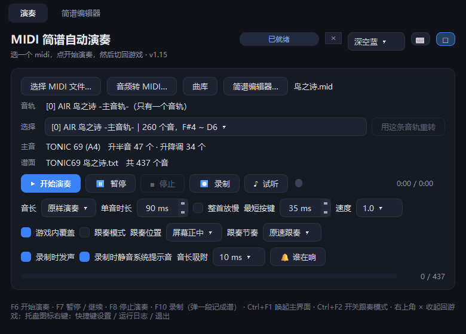
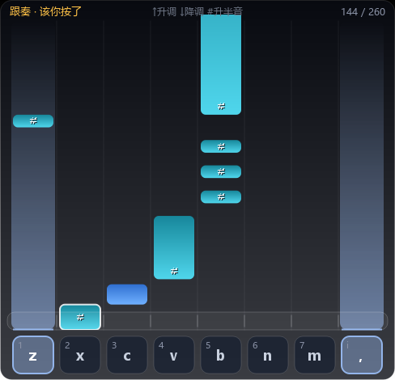

# MIDI 简谱自动演奏

读取 midi -> 推断最干净的主音(tonic) -> 生成简谱 txt -> 按谱面在游戏里自动按键演奏。

## 安装（给最终用户）

不想装 Python、不想碰命令行，就用安装包：

```
build_installer.bat
```

一次打**两个**安装包（都在 `发布\` 下）：

| 安装包 | 安装包大小 | 装完 | 里面有什么 |
| --- | --- | --- | --- |
| `AutoPlay 完全版 安装程序 v1.0.exe` | 约 205 MB | 402 MB | 全部功能：演奏 + 跟奏 + F10 录制 + 简谱编辑器 + 音频转 MIDI + 内置曲库 |
| `AutoPlay 精简版 安装程序 v1.0.exe` | 约 88 MB | 102 MB | 去掉「音频转 MIDI」「简谱编辑器」「F10 录制」，**跟奏照旧有** |

两个都是**自解压的单文件安装程序**：程序本体（连 Qt、numpy，完全版还有 basic-pitch 那一套）
压在自己的尾巴上（追加的 zip + 16 字节尾巴，见 `make_installer.py`），拷到任何一台 Windows
上双击就能装 —— 目标机器**不用装 Python**，也不用联网。

精简版装到 `%LOCALAPPDATA%\AutoPlayLite`，快捷方式名字和卸载表项都跟完全版分开，
两个版本可以同时装在机器上、互不影响（设置里的键位是共用的）。

安装界面里可以：

* 改**安装目录**（默认 `%LOCALAPPDATA%\AutoPlay`，装这里不需要管理员权限；
  想全机共用可以改成 `C:\Program Files\AutoPlay`，那种目录要管理员权限）；
* 选要不要**创建桌面快捷方式**、**开始菜单快捷方式**；
* 选要不要**把 `.mproj` 工程文件关联到本程序**（只有完全版有这一项 —— 精简版没有编辑器，
  关联了也打不开工程）。勾上之后，在资源管理器里**双击 `.mproj` 就直接开程序并进编辑器**，
  不用先开程序再「打开工程」。只写 `HKCU\Software\Classes`，不需要管理员权限，
  卸载时那份 `卸载.bat` 会一起清掉；
* 选要不要**装完立刻运行**。

装出来的目录结构：

```
AutoPlay.exe        主程序：演奏 + 简谱编辑器（两个标签页；精简版只有「演奏」一页）
songs\              内置曲库，默认那首是《鸟之诗》，往里扔 .mid 就会出现在「内置曲库」里
_internal\          运行库（Qt / numpy / basic-pitch…），别删别改
说明.txt             快捷键和用法
卸载.bat             双击卸载（也会注册进「设置 → 应用」，跟正常软件一样卸）
```

安装程序只写 `HKCU`（当前用户），不碰系统目录、不装服务、不写开机自启。

两个版本差的那 300 MB 全是「音频转 MIDI」用的 basic-pitch 那一套
（llvmlite 115 MB + onnxruntime 39 MB + scipy 58 MB + librosa / numba / sklearn…）。
**只用 midi、不需要 mp3 转换就下精简版**；自己从源码打也行：`python make_installer.py all`
会一次把两个都打出来（`app` 只打主程序，`payload` 只重压 payload）。

## 用法

图形界面（Qt，推荐）：

```
python main.py            # 会自动申请管理员权限
python main.py 1.mid      # 带上文件就自动转换好
python main.py --no-admin # 不提权（只调试界面时用）
```

界面用的是 Qt（装了 `PySide6` 或 `PyQt6` 都能跑）。

打包好的 exe，都是**没有黑框**、双击运行、只会弹一次 UAC：

| exe | 说明 |
| --- | --- |
| 装出来的 `AutoPlay.exe` | 完全版：演奏 + 跟奏 + 简谱编辑器 + 音频转 MIDI + 内置曲库 |
| `dist_lite\AutoPlay\AutoPlay.exe` | 精简版（`edition.LITE = True` 那一份）：没有音频转 MIDI、编辑器和录制，**跟奏还在** |
| `dist\AutoPlay\AutoPlay.exe` | 同一份程序，build.bat 直接打的中间产物 |
| `FollowPlay\AutoPlayFollow\AutoPlayFollow.exe` | 老的分家版（现在和上面是同一份程序，只是 exe 名字不同） |
| `EditorPlay\AutoPlayEditor\AutoPlayEditor.exe` | 只要编辑器、不要那 400 MB 音频转换时的轻量版（约 100 MB） |

启动时**没指定文件就自动载入内置曲库的第一首**（安装包里是《鸟之诗》）；
想换曲子点「选择 MIDI 文件…」或者「内置曲库」（后者永远用浮层里的列表，不弹窗）。

除了 midi，也能直接选**音频**（mp3 / wav / flac）：程序会先把它转成单音 MIDI 再走同样的
流程，见「从音频（mp3）开始」。`v1.0备份\` 里是加音频转换**之前**的那一版，想退回就用它。

三个贴心设定：

* 点「开始演奏」后主窗口只是**让到后面**，不隐藏也不最小化
  （隐藏会让程序切到后台、热键容易失灵；最小化又会把全屏游戏顶回桌面）；
* 演奏进度由一个**独立的半透明小浮窗**显示，贴在屏幕右上角、置顶、鼠标能穿透，
  只写「演奏中 / 已暂停 / 已停止 + 进度」，尽量不挡游戏画面；
* **演奏结束 / 停止都不会再把窗口弹回来**（弹窗会把全屏游戏顶掉），
  要调界面就点托盘图标、右键托盘图标选「显示窗口」，或者在游戏里按 `Ctrl+F1`；
* 浮窗在**没有演奏但已经读好 midi** 的时候显示「**已就绪** + `0/总音数`」，
  演奏中 / 已暂停 / 已停止 / 演奏完成都会实时变。

界面最下面一排还有「**♪ 试听**」：按谱面自己合成一小段音频放出来（音乐盒 / 电子琴音色，
见下），先听一遍确认旋律抓对了，再进游戏自动演奏。再按一次、开始演奏、换文件、退出都会
自动停。详见「[试听](#试听)：先听一遍再进游戏」。

多音轨的 midi（比如 18 条轨的钢琴曲）会自动挑最像主旋律的那条：先看轨道名里有没有
`主音轨 / 主旋律 / melody / lead / solo …`，没有就取音符最多的（打击乐通道不算）。
挑得不对，可以用界面上的**音轨下拉框 + 「用这条音轨重转」**自己指定：
下拉框里每条轨都标了音符数和音域，选好点按钮就重新生成一份谱面。
手动选的音轨，谱面文件名会多一个 `#t序号` 后缀（如 `TONIC67 曲子#t5.txt`），
这样同一首歌不同音轨的谱面不会互相覆盖。

只转换不演奏：

```
python convert.py 1.mid
```

看某个 midi 的每个音：

```
python dump_notes.py 1.mid
```

## 快捷键

| 键 | 作用 |
| --- | --- |
| F6 | 开始演奏（有 3 秒时间切到游戏窗口） |
| F7 | 暂停 / 继续 |
| F8 | 停止 |
| F10 | 开始 / 结束**录制**（把你弹的记成谱，见「录制」一节；精简版没有这一行） |
| Ctrl+F1 | 在游戏里唤起主界面（换 midi 用）；再按一下收回去 |
| Ctrl+F2 | 开关跟奏窗口（只有含跟奏版有） |
| ESC | 收起主界面回游戏；关掉「游戏内覆盖」后是退出程序（只在主窗口里按有效，游戏里按 ESC 不会退） |
| F11 | **最大化 / 还原**主窗口（不是全局热键，得主窗口拿到焦点时按；编辑工程时铺满整块屏幕用） |

**键位可以自己改**：界面上标题行右边那个 `⌨` 小圆钮（托盘右键菜单里的「快捷键设置…」同一个），
打开后点某一行的按键，
再直接按下想用的组合键就行（可以带 Ctrl / Shift / Alt），改完立刻生效、不用重启，
并且记在设置里。能绑的键：字母、数字、F1–F24、小键盘、方向键、空格、
`Esc` / `Tab` / `Enter` / `,` `.` `/` 这些常见键；一行里按 `Esc` 取消这一行，
「默认」把这一行恢复成上表的默认键位。重复的组合键会被拦住并提示已经被谁占用了。

热键做了两层保险（`hotkeys.py`）：除了 `keyboard` 库，还自己用 ctypes 装了一个
`WH_KEYBOARD_LL` 低级键盘钩子，钩子被系统摘掉或者线程挂掉会自动重装，界面上每 5 秒
自检一次。演奏时 F7 / F8 不会因为切窗口而失灵，一次按键也只响应一次（250 毫秒去重）。

## 界面：控制台



主界面就是上面这样：上面一排按钮（选文件 / 音频转 MIDI / 曲库 / 编辑器），
中间是当前这首的信息和演奏参数，最下面是键位提示。

* **「控制台」（运行日志）默认是收起来的**：以前它常驻在窗口下半部分，又杂又占地方。
  想看的在**托盘图标上右键 →「运行日志（控制台）」**（跟「快捷键设置…」一个路子），
  再点一下就收起；开不开会被记进设置，下次打开还是上次的样子。
* **收起时窗口会自己贴合内容**：控制台关着，窗口高度就只到内容为止，不会留一大块空地；
  打开控制台，窗口自动长高给它让地方。想把它拉大 / 拉小随意（`F11` 铺满整块屏幕）。
* **不会再把字裁掉了**：窗口不最大化、甚至拉到最小（700×560）时，按钮和文字都完整显示 ——
  样式表里的内边距本来不计入 Qt 的「最小尺寸」，以前窗口一矮就会把按钮压扁、把字上下切掉，
  现在每个控件的真实高度都算得进去，宁可让窗口长高也不裁字。

## 跟奏模式



游戏里按 `Ctrl+F1` 唤出主界面，勾上「**跟奏模式**」（或者直接按 `Ctrl+F2`），
屏幕上会多出一块无边框、半透明、磨砂质感的跟奏面板，盖在游戏画面上面：

* **长条音符**从上往下落，长条的长度就是这个音要按多久（跟 midi 时值走）；
  音够长（超过 13 像素）时，长条上还会直接写记号：`↑` 升调、`↓` 降调、`#` 升半音，
  组合起来就是 `#↑` / `#↓`；
* 落到下面那个**圆角判定框**就消失 —— 超出框的部分不画出来，看起来像「按进去了」；
* 最下面是 `z x c v b n m ,` 八个琴键，正好对应简谱的 `1 2 3 4 5 6 7 i`；
* 哪个键正被按住（程序自己弹的也算），**对应那一列会发光**、判定线上也亮一条，
  琴键本身跟着高亮；
* 顶上那行是状态和进度，比如 `跟奏 · 演奏中　12 / 437`。

音符**颜色代表「要按住哪个鼠标键」**（也就是哪种操作），窗口最上面那条图例把六种颜色
和操作一一对上，照着看就行。「等长演奏」时一个音只有几十毫秒、色块短得写不下记号，
光靠颜色也认得出：

| 颜色 | 记号 | 要按住 |
| --- | --- | --- |
| 蓝 | `E1` | 什么都不按（正常八度） |
| 青 | `#E2` | 中键（升半音） |
| 琥珀 | `A2` | 右键（升调） |
| 橙红 | `#A2` | 右键 + 中键（升调 + 升半音） |
| 紫 | `B5` | 左键（降调） |
| 粉 | `#B7` | 左键 + 中键（降调 + 升半音） |

### 跟奏节奏

界面上的「跟奏节奏」有两种：

| 节奏 | 说明 |
| --- | --- |
| **等我按对**（默认） | 练习模式：程序**一个键都不发**，音符落到判定线就停住等你，你按对那个键才继续往下走。新手不用被原曲速度拖着跑 |
| 原速跟奏 | 跟着程序自动弹的演奏器走，音符按原曲速度下落，边弹边看 |

练习模式下按错键不往前走，只把那一列闪一下红（按对闪绿）；音符停在判定线上等你的
时候，它会描一圈白边、顶上写「该你按了」。F7 暂停 / 继续、F8 停止都照常，
进度条和右上角浮窗跟着「按对了几个音」走。

几个细节：

* 面板是**鼠标穿透**的 —— 必须这样，因为升降调用的就是鼠标键，被这一层挡住的话
  修饰键就发不进游戏了；也正因为穿透，它没法用鼠标拖，位置在界面上的「跟奏位置」里选
  （**底部偏上** / 屏幕正中 / 顶部偏下 / 右上角 / 底部靠左 / 底部靠右），选完会记住；
  上下都按屏幕高度留了 7%（最少 40 像素）的空白，不会贴着屏幕边缘；
* 磨砂用的就是 Windows 的亚克力模糊；系统不支持（或者关了「透明效果」）就退化成
  半透明深色面板，功能不受影响；
* 时间轴和真正发按键的演奏器是**同一个钟**（`player.elapsed()`），暂停时音符一起停住；
* 普通版 `AutoPlay.exe` 里没有这个窗口，按 `Ctrl+F2` 会提示你用含跟奏版的 exe。

## 游戏里的按键

| 谱面数字 | 按键 |
| --- | --- |
| 1 2 3 4 5 6 7 | z x c v b n m |
| i（高音 1） | , |

修饰键（按住才生效）：

| 记号 | 鼠标 | 效果 |
| --- | --- | --- |
| E | 不按鼠标 | 基础八度 |
| A | 右键 | 升调（+12 半音） |
| B | 左键 | 降调（-12 半音） |
| # | 中键 | 升半音（+1） |

`#` 写在最前面，可以和 A / B 同时出现（`#A2` = 升调 + 升半音 = +13）。
没有降半音，所以「低半音」写成低一级的音加 `#`（`#E1` = +1）。
A 和 B 不会同时出现。

## 简谱规则

以 tonic 为 1，用大调音阶：`1 2 3 4 5 6 7 i`（i = +12 半音）。
每个音都落在相对 tonic 的 `[-12, +25]` 半音范围内：

```
B1 B2 B3 B4 B5 B6 B7 Bi | E1 E2 E3 E4 E5 E6 E7 Ei | A1 A2 A3 A4 A5 A6 A7 Ai
 -12 ……            0     |  0 ……              +12  | +12 ……            +24
```

举例（tonic = 71 = B4）：`E1`=B4、`E2`=C#5、`#E2`=D5、`Ei`=B5、`A2`=C#6、`B5`=F#4。

## 谱面文件

文件名固定为 `TONIC<tonic> <midi 文件名>.txt`，例如 `TONIC69 1.txt`；
手动指定音轨时是 `TONIC<tonic> <midi 文件名>#t<音轨号>.txt`，例如 `TONIC67 曲子#t5.txt`。

内容是一串空格分隔的 `音:持续时间`，持续时间单位是秒，从头累加就是每个音的起点：

```
E2:0.467 0:0.025 E3:0.221 0:0.025 E4:0.209 0:0.037 Ei:0.246 ...
```

`0` 是休止符（这段时间不按任何键），这样节奏和 midi 完全对齐。
小于 0.02 秒的空隙不写休止符，直接并进上一个音的时值（开头的小空隙直接忽略，最多差 20 毫秒）。
时间轴按毫秒对齐后再求差，所以累加不会漂。

演奏时是**按住**：每个音按下后就按着，按满这段时值才松开（长音会一直按着，
短音很快松开），所以按键时长和 midi 里的真实时值一致。快到下一个音时会提前
12 毫秒松开，免得两个音粘在一起；带修饰键（A / B / #）的音会提前 20 毫秒
把鼠标按下去，保证琴键正好落在音头上。

界面上的「**音长**」决定怎么处理这些时值，见下一节；「**最短按键**」（默认 35 毫秒）
是实际按下时的保底值。同一个键连续出现时中间会留 30 毫秒的松开间隙，游戏才认得出是两下。

## 音长：怎么弹才不被吞音

游戏是按帧读键盘的，一个音按得太短就会被吞掉。界面上的「音长」有两种弹法：

| 音长 | 说明 |
| --- | --- |
| **原样演奏**（默认） | 原封不动跟着 midi 的时值走，长短有起伏、跟原曲一样；太短的音会被「最短按键」托底，不至于被吞掉 |
| **等长演奏** | 每个音都按住「单音时长」（默认 90 毫秒）这么久，长短一样、听着最稳；下一个音来得太早时这个音自动缩短，代价是长音也会变成短促的一下 |

默认情况下整理只动「每个音按住多久」，**曲子的快慢一点都不会变**：每个音什么时候响跟
原曲完全一致。想让每个音都按满「单音时长」，就勾上这个复选框：

| 选项 | 说明 |
| --- | --- |
| **凑不够就整首放慢**（默认不勾） | 谱面里有音比「单音时长」还短时，把**整首歌等比放慢**（等于降 BPM）来凑够长度 —— 长短关系不变，但曲子会变慢；放慢多少写在日志里，最多 8 倍 |

「最短按键」（10~200 毫秒）是实际按下时的兜底，一般不用动。演奏结束会在日志里提示
有多少个音贴得太紧 —— 那些音想按久也按不了（会盖到下一个音头上），除非勾上面的选项
或者把速度调慢。

## 从音频（mp3）开始

不想自己找 midi 的话，点界面上的「**音频转 MIDI…**」（或者在文件列表里双击蓝色的音频
文件），程序会先把音频转成 MIDI，再走下面那套流程。转出来是一个 .mid、最多三条音轨：

* `melody lead`：**主旋律，单音、绝不重叠** —— 程序默认弹这条。它是「最响」和
  「最高」两条规则**融合**出来的：先比响度分档，同一档里再比音高；
* `melody2 loud` / `melody3 high`：两条原始候选（只在跟融合结果不一样时才写），
  听不惯默认那条可以在这里 A/B 对比；
* `full all-notes`：**完整转谱**（多音同时），留着核对或者丢进 DAW 改。

选完音轨以后可以在下拉框里换（`melody lead` 是自动选中的那条），换完按「用这条音轨重转」。

转换算法按「装了哪个就用哪个」自动挑：

| 后端 | 装它要多大 | 适合 |
| --- | --- | --- |
| **basic-pitch**（推荐） | 约 50 MB（ONNX 推理，**不用 TensorFlow**） | 有伴奏、有编曲的完整编曲 |
| `pip install librosa`（pyin） | 约 100 MB | 独奏、清唱、单声部 |
| 内置 YIN（兜底） | 0（只用 numpy） | 只有它是单声部的时候才准 |

装 basic-pitch（国内加清华镜像快很多；3.12 上要分两步，它那条 TensorFlow 依赖装不了）：

```
pip install -i https://pypi.tuna.tsinghua.edu.cn/simple --no-deps basic-pitch
pip install -i https://pypi.tuna.tsinghua.edu.cn/simple librosa pretty_midi mir_eval resampy scikit-learn onnxruntime
```

**不建议**再用老版本那个「先把频段截到 200~2000 Hz 再估基频」的做法（默认已经关掉，
只在兜底 YIN 上留了个 `--melody-focus` 开关）：那等于把低音和镲直接砍掉，对旋律提取
没有好处。

Melodia（真正的主旋律提取）、Demucs（先分轨再识别）这些更重的方案，以及每个后端的
优缺点，见 `mp3midi/README.md`。转换在后台线程里跑，界面不会卡；生成的 .mid 默认
就放在音频文件旁边。

## 试听：先听一遍再进游戏

选完 midi（或者刚转完音频）按界面上的「**♪ 试听**」，程序会按当前谱面合成一小段音频
放出来 —— 听对了再去游戏里弹，省得白弹一遍。游戏内浮层里也能按（它只是出声，不发按键）。

* **音色**：不用系统的 MIDI 音源（不是每台机器上都有），而是拿 numpy 叠几个正弦当
  「琴音」（基音 + 三个泛音 + 指数衰减包络），听着像音乐盒 / 电子琴，认音高足够了。
* **时间轴**：严格按谱面「音:持续时间」（**原样时值**），不受界面上「音长 / 速度」影响 ——
  听到的就是这首歌本来的节奏，音尾同样裁到下一个音之前，所以试听也是单音。
* **进度**：试听按钮旁边就是**进度条** —— 点一下或者拖着就能跳到想听的地方，
  右边那行字显示「0:12 / 1:35」；右上角状态胶囊上也会同步写，放完自动收尾。
  （`winsound` 本身不能跳转，程序的做法是把后面那一截另存成一个临时 wav 再放，
  所以拖动照样好使，代价是每跳一次会多写一个小文件，跳完就把上一个删掉。）
* **停止**：再按一次「■ 停止」；开始演奏、换文件、退出程序都会自动停。
* 合成一首 4 分钟的歌只要 0.1 秒左右（后台线程），临时文件放在
  `%TEMP%\AutoPlayPreview\`，每次试听前会把上一次的清掉。
* 播放用 Windows 自带的 `winsound`（异步），所以**只有 Windows 上能用**；
  游戏独占声卡时可能听不到，那就先关掉游戏或者用桌面音箱试听。

## 录制：把你弹的东西记成谱（`F10`）

自己编一段、或者在游戏里随手弹了一段觉得不错，按 **F10** 开始录，再按一下 F10 收工。
这期间你弹的每一个键都会被记下来：**什么时候按下、按住多久、按下那一刻鼠标哪个键是按着的**。

| 你按的 | 记成 | 含义 |
| --- | --- | --- |
| `z x c v b n m ,` | `1 2 3 4 5 6 7 i` | 琴键本身 |
| 按住鼠标**右**键再按琴键 | `A` 开头（如 `A1`） | 升调（+12 半音） |
| 按住鼠标**左**键再按琴键 | `B` 开头（如 `B1`） | 降调（-12 半音） |
| 按住鼠标**中**键再按琴键 | `#` 开头（如 `#E2`） | 升半音（+1） |

* **只认那八个键**：跑步的 WASD、程序自己的热键（F6–F10、Ctrl+F1…）一律不录 ——
  录制期间你照样能跑能跳，录下来的只有你弹的音。
* **桌面上录制不会「叮」一声了**：录制期间如果前台是**桌面 / 任务栏 / 输入法自己的窗口 /
  资源管理器 / 本程序自己**（或者干脆查不到前台窗口），这八个键会被钩子吃掉、不再传给系统 ——
  以前它们会落到输入法 / 桌面上，被接住时「叮」一下，那就是系统提示音的来源。
  吃掉之后还会投给一个**收键窗口**（消息专用窗口，不显示、不抢焦点）：按键有个正经接收人，
  而不是凭空消失。游戏在前台时一律照常传过去（那个音得游戏自己发），记录不受影响。
* **录制时静音系统提示音**（界面上那个勾选框，默认勾着）：一开始录制就把
  「系统提示音」那一路按成静音，收工自动放回去 —— 只动系统那一路，游戏、音乐、
  程序自己的琴键声都不受影响；万一程序崩了没放回去，下次打开会自动放开。
* **「🔔 谁在响」**：录制时蹦出一声提示音、不知道谁干的，点它，接下来 10 秒里只要有程序
  出声就把进程名记到日志 —— 写着 `(系统提示音)` 就说明是系统那一路（勾上「录制时静音
  系统提示音」就能按住它），写着别人的名字（输入法、游戏平台、录屏 / Overlay…）
  就去那个软件里关掉按键提示音。
* **日志会记「前台是谁」**：录制期间前台窗口一换就记一行
  （`录制中前台窗口：Progman（explorer.exe，PID 85184）—— 这八个键被吃掉`），
  出问题的时候一眼就能看出按键当时是被吃掉了还是送给了游戏。
* **音长吸附**（界面上那一行，默认 **10 毫秒**）：录完把每个时值吸到最近的格子上 ——
  按了 354 毫秒、格子上理论值是 350 毫秒，就记成 350；空档（休止）也一起吸，
  不然光吸音长会把节奏切碎。想原封不动保留你按出来的毫秒数，选「关」。
  改了几个时值会写在日志里（`音长吸附（10 毫秒）：4 个时值修到了格子上`）。
* **音长是你弹的**：按多久就记多久（这里记的是**你自己的时值**，跟「原样演奏 / 等长演奏」
  那两种按 midi 时值来的模式无关），两个音中间的空档写成休止符 `0`。
* **单音是硬要求**：真按出和弦、或者上一个音忘了松手，后面的音会把前面的截断；
  被截短了几个会写在日志里 —— 想还原就去编辑器里把前一个拖长。
* **一次出三样**：`TONIC<主音> 录音 日期 时间.txt`（谱面）、同名的 `.mid`（单音，别的软件也读得了），
  并且**直接送进「简谱编辑器」**—— 录的时候手滑了，当场拖一下就行，改完按「导出 MIDI」自动载回来。
* **录完就是「当前这首」**：收工之后直接按 F6 就能原样弹一遍听听，不用再去选文件。
* 文件放在 `%LOCALAPPDATA%\AutoPlay\recordings\`（完整路径也会写在日志里）。
* 主音跟着当前这首歌走（没载入过歌就用 60 = C4）；想换主音，在编辑器里改「主音」再导出。
* **录制时发声**（界面上那个勾选框，默认开着）：勾着，录制时按下一个琴键就实时响一声，
  听得出自己弹的是哪个音、有没有按错；不勾就全程静音。**开就是开、关就是关**，
  不去猜「现在在不在游戏里」—— 觉得跟游戏声音打架就自己关掉。
  **按住多久就响多久**：监听音是一段很长的持续音，按下开始放、松开立刻停（松开那一下
  由 `NotePlayer.release` 掐掉），长按听到的就是一个长音，不再是响一下就没了。
  （技术上：`winsound` 的 `SND_MEMORY` 不能和 `SND_ASYNC` 一起用，所以是每个音高
  合一次、写成临时目录里的 wav 再异步放文件，`%TEMP%\AutoPlayMonitor\`。）
* 录制期间右上角浮窗会亮「**录制中 + 录到几个音**」，主界面左上角的胶囊同款提示。

录制**只在完全版里**：录出来就是一份没修过的谱，没有编辑器就只能干看着，
所以精简版里连这一行键位都一起摘掉了（按了也只会提示用完全版）。

## 联网曲库：把曲子放 GitHub 上共享

程序自己不用服务器：把 midi 传到**一个 GitHub 仓库**里，程序读一个地址就知道曲库里有啥。

```text
仓库                          程序看到的
  songs/鸟之诗.mid            点「联网曲库」-> 歌单（标题 / 作曲家 / 大小 / 已下载）
  songs/别的歌.mid            点「下载并载入」-> 下到本地 -> 直接读进来
```

**索引文件 `library.json` 是可选的。**仓库里只有 midi 就行 —— 程序读地址时如果发现
没有索引（或者压根不是 json），会退一步**直接问 GitHub「这个仓库里有哪些文件」**，
把里面所有 `.mid / .midi` 列成歌单。想要标题 / 作曲家这类额外信息、或者仓库里
混着别的东西时，再放一个索引：

`library.json` 长这样（`file` 写**相对于索引文件的路径**，程序只要一个索引地址
就能推算出每首歌的下载地址）：

```json
{
  "version": 1,
  "songs": [
    {"title": "鸟之诗", "artist": "Lia", "file": "songs/鸟之诗.mid",
     "size": 9031, "sha1": "7dcfc4619cb831b241bb9340cce0dc1892576496"}
  ]
}
```

`size` / `sha1` 可以不写；写了就会校验，下坏了能看出来。

**索引地址**（任选一个格式，推荐上面那个，国内更稳）：

```text
https://cdn.jsdelivr.net/gh/<用户名>/<仓库>@<分支>/library.json
https://raw.githubusercontent.com/<用户名>/<仓库>/<分支>/library.json
```

地址有两种填法：

| 填哪儿 | 什么时候用 | 要不要重新打包 |
| --- | --- | --- |
| `library_source.py` 里的 `INDEX_URL` | 想把地址**固定进安装包**（发给别人就自带） | 要（用下面那个脚本） |
| `%LOCALAPPDATA%\AutoPlay\library\source.txt` 写一行 | 自己换源 / 临时试 | 不用，重启即可 |

写好地址之后，在项目目录里跑：

```text
设置联网曲库并重新打包.bat            （双击，按提示粘贴地址）
python -X utf8 set_library_url.py <地址>            （等价，命令行）
python -X utf8 set_library_url.py <地址> --no-build  （只写地址，不打包）
python -X utf8 set_library_url.py --clear            （清掉地址）
```

脚本会**先试拉一下**这个地址，告诉你通不通、里面有几首歌，再写进 `library_source.py`
并重新打两个安装包（「发布」文件夹里那两个）。

几个说明：

* **断网什么都不影响**：拉不到索引就显示上次拉到的歌单（缓存在
  `%LOCALAPPDATA%\AutoPlay\library\`），下载过的曲子照样能用，
  程序自带的 `songs\`（默认《鸟之诗》）也一直在；
* 地址是 `raw.githubusercontent.com` 的话，程序会**自动补一个 jsDelivr 镜像**再试一次；
* 下载校验 `size` / `sha1`，对不上会拒绝写入并告诉你；
* 在游戏里点「联网曲库」只会记一行日志（要联网挑歌，回桌面再点）—— 免得弹窗把游戏顶出全屏；
* 程序里也能**往曲库传曲子**：联网曲库窗口右下角「上传 / 整理曲库…」——
  传一首 midi，然后按仓库里现有的文件自动重排 `library.json`（索引不会和仓库对不上）。
  界面上没有「填令牌」这一项：点「上传」就等于同意把这首曲子分享出去。

  上传走哪条路，取决于注册的那个「**上传中转**」（上传窗口里会写明白）：

  | 方式 | 用户要不要填令牌 | 安装包里有没有密钥 |
  | --- | --- | --- |
  | **中转**（推荐）：程序 → 你自己搭的 Cloudflare Worker → GitHub | 不用 | ❗ 一行都没有，可以放心公开发布 |
  | 内置令牌（老做法）：令牌直接在 `github_token_local.py` 里 | 不用 | ⚠ 能被抠出来，别公开传 |

  中转是为了解决「令牌跟着安装包走」这个死结：令牌放在你自己的
  Worker 上，安装包里只有一个地址；想换令牌、想停上传，在服务器上改一下就行，
  用户无感。怎么搭：**`中转上传\部署说明.md`**（免费，十分钟）。

  搭完拿到地址后：

  ```text
  设置上传中转并重新打包.bat          （双击，按提示粘地址）
  python -X utf8 set_relay_url.py <地址> --strip-token
  python -X utf8 set_relay_url.py <地址> --key <口令>          （中转设了 UPLOAD_KEY 就得带上）
  ```

  地址写进 `relay_source.py`（这个文件进 git，所以只放地址）；
  口令写进 `relay_key_local.py`（**这个文件不进 git**，`.gitignore` 里已经挡好了）。
  口令只是为了挡住「知道地址就往里塞东西」的人，不是安全措施：
  它能被挖出来，但换不来你的令牌 —— 令牌只在服务器上。

  加上 `--strip-token` 会顺手把 `github_token_local.py` 里的令牌清掉 ——
  这样打出来的安装包**可以直接公开发布**：用户打开就能传曲子，被拀也拀不出东西。
  没配中转的话，程序照旧走内置令牌（有就用），两样都没有就只提示一句，
  本地曲库 / 演奏 / 编辑器一概不受影响；
* ⚠ 曲库是**公开的开源仓库**：传上去的东西所有人都能看见、能下载。不想公开就别往里传，
  或者用私有仓库 + 带 token 的地址；
* 版权：往公开仓库上传别人的曲子属于二次创作，可能被投诉下架。

## 配色主题（json）

主界面、右上角进度浮窗、跟奏面板、编辑器**共用一套主题**，换一个全都跟着换。

* 预设 6 套：深空蓝（默认）/ 午夜紫 / 松林绿 / 琥珀暖夜 / 绯红霓虹 / 石墨灰；
* 换主题：标题行那个下拉框，或者**托盘图标右键 →「配色主题」**；
* 主题文件是 json，第一次运行写到 `%LOCALAPPDATA%\AutoPlay\themes\`，
  照着自己改一套就行（改完在托盘里点「重新载入主题文件」，不用重启）；
  便携版还可以把主题放在 exe 旁边的 `themes\` 里（同名覆盖）；
* 每个文件就是「角色名 -> 颜色」：

```json
{
  "name": "我的主题",
  "colors": {"bg": "#0f1219", "panel": "#161a23", "accent": "#3b82f6", "…": "…"},
  "notes": {"A": ["#c07a12", "#ffc247"], "#": ["#17879b", "#4fd6ec"], "…": ["…", "…"]}
}
```

* 角色名是语义化的：`bg` 窗口底色、`panel` 卡片、`control` 控件、`line` 边框、
  `text` / `text_dim` / `text_faint` 文字，`accent` 那一族是主色；
* 六种**操作色**（`''` 无操作 / `#` 升半音 / `A` 升调 / `#A` 升调+半音 / `B` 降调 /
  `#B` 降调+半音）**每套主题一套**，六套是各自单独挑的：换主题的时候音符也跟着换色，
  一眼就能看出「换过了」；但六种之间的区分度在每套里都保住了（等长演奏时色块很短，
  颜色是唯一的线索）。六套长什么样见 `docs/主题音符配色.png`；
* 状态色（绿=演奏中、黄=暂停、红=出错、粉=录制中）固定不跟主题转，含义优先。

**角色名一共有 66 个，外加音符那六个键。**每个角色管哪儿、预设是怎么算出来的、
怎么自己做一套、做好怎么共享 —— 都在 `docs/主题格式.md` 里，做主题照着它来就行。

## 转换流程

0. **（可选）音频转 MIDI**：选的是 mp3 / wav 就先转成单音 MIDI —— 逐帧估基频（YIN /
   pyin / basic-pitch）→ 平滑、量化到半音 → 切成一个个音（保证不重叠）→ 写成单轨 MIDI。
1. **读 midi**：`mido` 打开文件，`set_tempo` 也纳入计算，时值全是真实秒数。
2. **选主音轨**：只有一条音轨就直接用；多条先看轨道名里有没有
   `主音轨 / 主旋律 / melody / lead / solo …`，没有就取音符最多的那条
   （打击乐通道 10 不计入，免得选到鼓轨）。界面上的音轨下拉框可以手动改选，
   自动推荐的那条会写在「音轨」一行里。
3. **单音检查**：检查主音轨里有没有两个音同时响。
   * 有多音但能按 MIDI 通道拆出一条单音旋律线 -> 拆（type 0 文件常见）；
   * 拆不出来 -> 裁掉重叠，只保留最高音。
4. **算 tonic**：枚举 0~127 每个 tonic，给每个音算「代价」
   `折回八度 * 1000 + 升半音 * 10 + 升降调 * 3`，总代价最小最干净；
   代价相同时优先 tonic 本身出现在旋律里、离旋律中心最近的。
5. **写谱面**：按上面的格式生成 txt。

## 简谱编辑器：转出来的谱不顺耳就手动修

编辑器现在是主程序里的**第二个标签页**（界面左上角「简谱编辑器」），点「简谱编辑器…」
按钮会切过去并顺手把当前这首塞进去 —— 它和主程序在同一个进程里，不是另开的程序，
改完导出 midi 还会**自动载回主程序**接着弹。把一条音轨铺成**钢琴卷帘**，看着改、改完直接听：

* **看**：横着是时间、竖着是音高，方块长短就是时值；方块上写着它在简谱里的记号
  （`E2` / `#A1` / `B5`…），颜色按「要按住哪个鼠标键」分，跟跟奏窗口是同一套配色；
* **改**：双击空白加音、右键音块删音、按住拖动、拖右边缘改长短、方向键微调
  （Shift+左右改时值、Shift+上下跳八度）、`Del` 删掉选中的、`Ctrl+Z` 撤销；
* **听**：整首实时试听，下面那根进度条**拖着就能跳**；**改完自动重新合成**，
  从当前光标接着放 —— 改一个音听一个音，不用来回按播放；双击音块还能单独听这一个音；
* **存**：没改完也能存成**工程文件**（`.mproj`，其实就是个 json，记着音符 + 主音 + 速度 +
  来源），下次「打开工程」接着改；改完「导出 MIDI」写出单音 `.mid`，直接丢给主程序弹。
  导出时会把互相压着的音剪短（游戏只认单音），剪了几个会写在日志里。
* **双击就能开**：`.mproj` 是能在资源管理器里双击打开的（装的时候勾了「关联文件类型」的话，
  见「安装」一节；程序里那个「双击 .mproj 工程文件用本程序打开」勾选框也能随时开关）——
  双击之后程序会带着这个工程**直接进编辑器那一页**，不用先开程序再找文件。
  工程文件读不动（坏了 / 被删了）就留在「演奏」页，只把原因写进日志。
* **程序已经在跑的时候双击工程文件**：**不会再起一个程序**。那个新进程会把要打开的
  文件转交给已经在跑的这一个（`WM_COPYDATA` + `single.py`），自己立刻退出；这边
  **另开一个编辑器窗口**打开它 —— 关掉这个窗口不影响主窗口，双击第二个工程就是第二个
  窗口。认「同一个程序」认的是 exe 路径（不是窗口标题，标题会随载入的曲子变），
  所以完全版和精简版各认各的。
* **能最大化**：编辑器那一页右上角有一个 `□` 按钮（「演奏」页标题行里也有一个），
  按一下主窗口就铺满整块屏幕，卷帘能多看一大截；再按一下还原，或者直接按 `F11`。
  单独跑 `AutoPlayEditor.exe` 时用系统标题栏上那个最大化，`F11` 一样管用。

快捷键：`空格` 播放/停止、`Ctrl+O` 打开 midi、`Ctrl+S` 存工程、`Ctrl+E` 导出、
`Ctrl+Z` / `Ctrl+Y` 撤销重做、`Ctrl+A` 全选；`Ctrl+滚轮` 缩放、`Shift+滚轮` 横滚。
（嵌在主程序里时这些键只在焦点位于编辑器那一页时生效，不会抢「演奏」页的按键。）

编辑器本身**不往游戏里发按键**，所以 `AutoPlayEditor.exe` 那份不带 UAC；
主程序那份因为要发按键，还是照常提权。

## 自动保存：没存也不怕（v1.11 起）

录完一段、或者在编辑器里改了半天还没按「保存工程」，程序会**每几秒悄悄留一份底**：
放在 `%LOCALAPPDATA%\AutoPlay\autosave\`，格式跟「保存工程」一样（`.mproj` 的 json），
所以你甚至可以把它当成一份普通工程拖进编辑器。

* **正常退出程序**、或者把这份存成了工程之后，这份底会自己清掉，不会一直堆着；
* **程序被强杀 / 崩了 / 断电**（没来得及清）—— **下次启动会自动摆回编辑器**：最新的一份
  进「简谱编辑器」那一页，上次还开着几份就再各开一个窗口，日志里会写「上次没有正常退出，
  已经自动恢复 N 份没保存的谱面」；
* 恢复出来的那份**算「还没存过」**（标题前面带 `*`），按「保存工程」存下来、或者
  「导出 MIDI」导出去之后，这份底才算交差；
* 关程序的时候，**另外开着的编辑器窗口**也会挨个问你一句要不要存；都答完了才会真正退出
  （所以答「取消」就还是退不出去）。
* 嫌它烦想自己清：关掉程序，把 `%LOCALAPPDATA%\AutoPlay\autosave\` 整个删掉就行。

写盘这件事做得很克制：每 2.5 秒看一眼「改过没存吗」，而且**比对内容指纹** —— 内容没变
就不写，拖一个音不会拖出一堆读写。

## 文件说明

| 文件 | 作用 |
| --- | --- |
| `jianpu.py` | 音高 <-> 记号互转、谱面文本读写 |
| `midi_analyze.py` | 选主音轨、单音化、推断 tonic、生成谱面 |
| `player.py` | 演奏器（pydirectinput 发按键 / 鼠标修饰键） |
| `preview.py` | 试听：谱面 -> numpy 合成波形 -> wav（winsound 异步播放） |
| `follow.py` | 跟奏窗口：下落式长条音符 + 八个琴键 + 按住哪列哪列发光 |
| `hotkeys.py` | 全局热键：键位表（可自定义）+ 自带的低级键盘钩子 + keyboard 库双保险、自动重装 |
| `recorder.py` | 录制：低级键盘 / 鼠标钩子记下你弹的每个键和按住时长，单音化后写成谱面；吃掉的那一下投给收键窗口（`_sink_key`） |
| `audiowatch.py` | 音频会话（WASAPI，纯 ctypes）：查谁在出声 / 读进程名 / 录制时按住「系统提示音」那一路 |
| `notesound.py` | 录制时的监听音：每个音高合成一次小 wav，按键时异步放文件 |
| `single.py` | 单实例：双击工程文件时把文件转交给已经在跑的那个程序（`WM_COPYDATA`） |
| `autosave.py` | 自动保存：没存的谱面留一份底，意外退出后下次启动自动恢复 |
| `fileassoc.py` | `.mproj` 工程文件的关联：`HKCU\Software\Classes` 下写 ProgID + 打开命令 |
| `main.py` | Qt 图形界面 + 音轨选择 + 托盘 + 右上角半透明进度浮窗 |
| `convert.py` | 命令行转换 |
| `dump_notes.py` | 调试：列出每个音 |
| `editor.py` | 简谱编辑器：钢琴卷帘手工加减音符、实时试听、存工程 / 导出单音 midi |
| `noteicon.py` | 程序图标（矢量画的音符，不依赖字体）：主程序 / 安装程序 / 快捷方式共用 |
| `edition.py` | 版本开关：`LITE = True` 就是精简版（打包时临时改，源码里永远是 `False`） |
| `installer.py` | 安装程序：选目录 + 建快捷方式 + 写卸载信息，读自己尾巴上的 payload；自己认得出装的是哪一版 |
| `make_installer.py` | 打包安装包：画图标 -> 打主程序 -> 打安装程序本体 -> 压 payload -> 合成单文件 |
| `theme.py` | 配色主题：读 `themes\*.json`，把界面上写死的老色号换算成当前主题的颜色；六个预设的音符色各挑一套 |
| `docs/主题格式.md` | **主题 json 的说明书**：66 个角色各管哪儿、六种操作色怎么挑、预设怎么算出来的、怎么自己做一套并分享 |
| `library.py` | 联网曲库：拉索引 / 下曲子 / 本地缓存 / 断网回退；也能往仓库传曲子并重排索引（GitHub Contents API），只动标准库 |
| `library_source.py` | 打包进程序里的默认索引地址（由 `set_library_url.py` 写） |
| `relay.py` | 上传中转的客户端：把曲子 POST 给你自己的 Worker，让它替你写进仓库 —— 安装包里不带令牌 |
| `relay_source.py` | 打包进程序里的默认中转地址（由 `set_relay_url.py` 写；这个文件进 git，所以只放地址） |
| `relay_key_local.py` | 上传口令（对应中转的 `UPLOAD_KEY`）。**不进 git**，和 `github_token_local.py` 一个待遇；没有就当没配 |
| `set_relay_url.py` + `设置上传中转并重新打包.bat` | 填中转地址 -> 问一句 /health -> 写进 `relay_source.py` -> 重新打包（`--strip-token` 顺手清掉内置令牌） |
| `中转上传/worker.js` | 中转本体：Cloudflare Worker（令牌存它身上）。`/health`、`/upload`、`/reindex` 三个接口 |
| `中转上传/部署说明.md` | 中转怎么搭：建令牌、建 Worker、填变量、验证、常见问题 |
| `set_library_url.py` + `设置联网曲库并重新打包.bat` | 填好曲库地址 -> 试拉一下 -> 写进 `library_source.py` -> 重新打包两个安装包 |
| `songs/` | 内置曲库，装到安装目录下；默认那首是《鸟之诗》 |
| `mp3midi/` | 音频（mp3 / wav）转单音 MIDI：`audio2midi.py`（转换本体）、`probe.py`（看装了哪些后端）、`README.md`（后端对比 + Melodia / Demucs 怎么接） |
| `build.bat` + `AutoPlay.spec` | 打包成 `dist\AutoPlay\AutoPlay.exe`（窗口模式，已裁掉用不到的 Qt 组件） |
| `build_follow.bat` + `AutoPlayFollow.spec` | 打包「含跟奏版」到 `FollowPlay\AutoPlayFollow\` |
| `build_editor.bat` + `AutoPlayEditor.spec` | 打包简谱编辑器到 `EditorPlay\AutoPlayEditor\`（不带 UAC、不带音频转 MIDI） |
| `build_installer.bat` + `installer.py` + `make_installer.py` | 打包成两个单文件安装包：`发布\AutoPlay 完全版 安装程序 v?.exe`、`发布\AutoPlay 精简版 安装程序 v?.exe` |

## 打包

```
build.bat
```

等价于 `python -m PyInstaller --noconfirm --clean AutoPlay.spec`。
打包配置都在 `AutoPlay.spec` 里：`console=False` 去掉黑框、`uac_admin=True`
保证能往游戏里发按键、并且会删掉用不到的 Qt 组件（Quick / Qml / Pdf / Network /
语言包等）。成品**大约 400 MB** —— 大头是「音频转 MIDI」用的 basic-pitch 那一套
（光 llvmlite 的 DLL 就 115 MB，还有 onnxruntime 39 MB、scipy 58 MB）。
不想要这么胖就用**精简版**的打法：同一个 `AutoPlay.spec`，把环境变量 `AUTOPLAY_LITE=1`
打开就是精简版（成品 102 MB）—— 那一整套转谱库连本地 `mp3midi` 包和 `editor.py` 都不打进去，
界面上对应的入口也不出现。`make_installer.py` 打包时会自动做这件事：临时把
`edition.py` 里的 `LITE` 改成 `True`，打完立刻（`finally` 里）改回来。
要是哪天在没显卡驱动的机器上打不开，把 spec 里 `opengl32sw` 那行删掉再打包即可。

跟奏版单独打包到自己的文件夹（**现在跟主程序是同一份程序**了：跟奏窗口直接在主界面里，
`FOLLOW_MODE` 一律打开，这个 spec 留着只是为了兼容老流程、以及打一个别的名字的 exe）：

```
build_follow.bat
```

等价于 `python -m PyInstaller --noconfirm --clean --distpath FollowPlayNew AutoPlayFollow.spec`
再跑一次 `应用跟奏版更新.bat`，把 `FollowPlayNew` 覆盖到 `FollowPlay`。
先打暂存目录再覆盖，是因为程序开着的时候 `AutoPlayFollow.exe` 被锁住，
直接往 `FollowPlay` 里打会「清空目录 → 写不进去」，旧版本当场变成残缺的；更新脚本会等程序退出再覆盖。
两个 spec 内容基本一样，只有 exe 名字不同。以前 `main.py` 靠「exe 名字里有没有 follow」
决定跟奏窗口露不露出来，好让 `AutoPlay.exe` 当一条「干净的老版本」退路；现在编辑器也并进
主程序了，那条退路早就不「干净」了，所以跟奏一律打开（`FOLLOW_MODE = True`）。

编辑器单独打包（只要编辑器、不想背 basic-pitch 那 400 MB 时用）：

编辑器单独打包到自己的文件夹（跟上面两个互不干扰）：

```
build_editor.bat
```

等价于 `python -m PyInstaller --noconfirm --clean --distpath EditorPlayTmp AutoPlayEditor.spec`，
成功了再镜像到 `EditorPlay\AutoPlayEditor\`。成品**大约 100 MB** —— 它只读写 midi，
不带「音频转 MIDI」那一套（basic-pitch / onnxruntime / scipy / librosa 全排除了），
也不带 `keyboard` / `pydirectinput`，更没有 `uac_admin`。

## 常见问题

- **按键没反应**：游戏要用管理员权限运行，本程序也必须提权（走 `--uac-admin` 的 exe
  或 `python main.py` 自动提权），否则 Windows 会拦掉发送的输入。
- **开始演奏前**先点一次游戏窗口，让游戏拿到焦点；演奏过程中别动鼠标，
  因为修饰键用的是鼠标左右中键。
- **速度**：界面上的倍速是整体快慢，1.0 就是原速；太快容易糊在一起，慢一点更稳。
- **鼠标别停在屏幕最角落**：`pydirectinput` 自带「鼠标撞角落就中断」的保险，
  程序里已经把它关掉了（`player.py`），所以角落也不影响；但演奏时还是尽量别动鼠标，
  因为升降调用的就是鼠标左右键。
- **按住时间 / 吞音**：默认是「原样演奏」——跟着 midi 的时值走，长短跟原曲一样，
  太短的音有「最短按键」托底。要是听着还是有音被吞，把「最短按键」调大一点
  （它就是实际按下时的保底时长）；想每个音都按同一个长度、听着最稳，就把「音长」
  切成「等长演奏」；想每个音都按满「单音时长」又不介意曲子变慢，就勾「凑不够就整首放慢」。
- **游戏里一边跑步（按住 Shift）一边演奏**：程序发的是 `1z 2x …` 里的字母，你按着
  `Shift` 时游戏可能把这一下当成 `Shift+Z` 之类的组合键，未必认 —— 这属于游戏自己的
  组合键判定，不是程序发错键；先松开 `Shift` 再让它弹最保险。
- **跟奏窗口挡视线 / 想挪位置**：在界面的「跟奏位置」里换一个（它是鼠标穿透的，
  拖不动）；不想看就在界面或托盘菜单里取消「跟奏模式」，或者按 `Ctrl+F2`。
- **跟奏窗口没有磨砂**：说明这台机器拿不到亚克力模糊（Win10 1803 以前，或者系统设置里
  关了「透明效果」），会自动退化成半透明深色底，不影响使用。
- **游戏里按 Ctrl+F1 看不到窗口**：先确认勾了「**游戏内覆盖**」（默认是勾上的）。
  勾上时主界面会像录屏软件的浮层那样贴到游戏上：去掉标题栏、置顶显示、
  **不抢游戏焦点**（所以不会把独占全屏的游戏打回桌面），12 秒没人动就自动取消置顶，
  顶部空白处按住能拖动，`Esc` 或右上角 `×` 收起回游戏。
  要是还看不到，多半是游戏开着**独占全屏** —— 那种模式下 Windows 不允许任何窗口盖上去，
  把游戏改成「窗口化全屏 / 无边框窗口」就好（右上角进度浮窗和跟奏窗口也都需要这个模式）。
- **取消「游戏内覆盖」之后**：主界面恢复成带标题栏的普通窗口，`Ctrl+F1` 走老办法
  （置顶 + 抢前台），`Esc` 也恢复成「退出程序」。
- **选文件分两个入口**：
  - **在桌面上**（启动后直接点、或者点托盘图标把窗口叫出来）：用的还是**系统文件框**，
    能打字、能粘路径，怎么顺手怎么来；
  - **在游戏里按 `Ctrl+F1` 唤起来**：这时点「选择 MIDI 文件…」出的是**嵌在主界面里**
    的文件列表（跟跟奏窗口一个路子），全程**不新建任何窗口** —— 会惊动全屏游戏的往往
    就是那些额外弹出来的窗口。上面是「上一级 / 桌面 / 刷新」和当前路径，下面先列子文件夹
    （带 `/`）再列 MIDI 文件：**双击**文件夹进去、**双击** MIDI 文件开始读，也能选中后点
    「打开」。它跟浮层一样收不到键盘，**只用鼠标**操作；想在游戏里打字就先收起浮层回桌面。
- **录制时按字母键有系统「叮」的提示音**：按这个顺序排查。
  1. 确认界面上「**录制时静音系统提示音**」勾着（默认勾着）—— 它会在录制期间把
     「系统提示音」那一路按成静音，系统那声「叮」就是从这里来的；
  2. 还响就点「**🔔 谁在响**」，然后正常按你的键，看日志里冒出谁：写着 `(系统提示音)`
     说明还是系统那一路（那就是第 1 条没生效，或者声音是别的程序放的别名音）；
     写着别人的进程名（输入法、游戏平台、录屏 / Overlay 之类），就去**那个软件里**
     关掉「按键提示音 / 按键音效」；
  3. 日志里那行 `录制中前台窗口：…` 会告诉你按键当时是被吃掉了还是送给了游戏 ——
     要是写着「原样送给它」，说明前台那个窗口被当成了游戏，那就是它自己在响。
  顺便说一句：**自动演奏和本程序的录制本身从不发提示音**（放的是每个音高合成的小 wav，
  走的是本程序自己的音频会话，跟「系统提示音」那一路是分开的）。
- **程序崩了 / 被强杀，之前没存的谱面还在吗**：在。参见「自动保存」一节 ——
  下次启动会自动摆回编辑器。
- **最大化按钮在哪**：主界面右上角、蓝底描边的那个 `□`（编辑器那一页也有一个），
  按一下铺满整块屏幕，按 `F11` 也一样。最大化之后它会变成实心蓝的 `▣`。
- **想知道热键到底有没有触发**：看 `%LOCALAPPDATA%\AutoPlay\AutoPlay.log`，
  按一下 Ctrl+F1 会记一行「唤起主窗口」，后面还会跟着「主窗口以浮层方式贴到游戏上」
  或者「没抢到前台焦点/已顶到最前」。要是日志里出现「把前台还给游戏」，
  说明兜底替你挡了一次（本该不会发生）。
- **一点浮层游戏就掉回桌面**：v1.7 修好了。现在浮层是「不接受焦点」的窗口，游戏里
  **一个窗口都不会弹**：改快捷键的入口在游戏里是灰的（录键必须抢键盘焦点，做不到），
  选文件一律走浮层里的文件列表。判断「在不在游戏里」看的是**前台有没有一个盖满整屏的
  别人的窗口**，所以程序先在桌面上开着、之后才切进游戏，也一样认得出来。
- **精简版里没有的功能**：「音频转 MIDI」和「简谱编辑器」两个入口直接不存在。
  要转 mp3 或者手工改谱，装完全版（两个版本可以同时装着）。
- **窗口不见了**：演奏时主窗口只是被压到游戏后面，切出游戏就能看到；也可以点
  托盘图标召回（结束 / 停止都不会自动弹出来，免得把全屏游戏顶掉）。
- **F7 / F8 没反应**：先看右上角浮窗的状态字有没有变；浮窗只在演奏时出现。
  热键本身有自愈机制，真失灵了就按界面上的按钮，或者重启一下程序。
- **选错音轨了**：用界面上的音轨下拉框换一条，点「用这条音轨重转」；
- **在游戏里点下拉框（音长 / 速度 / 跟奏位置 / 音轨）会不会掉回桌面**：不会了。
  Qt 的 `QComboBox` 下拉列表其实是一个**独立的顶层窗口**，一弹出来就把自己设成前台，
  独占全屏的游戏碰上这一下就掉桌面（给它挂 `WS_EX_NOACTIVATE` 也压不住 —— Qt 自己还会
  再激活它一次，实测过）。现在这几个下拉框是自绘的（`InlineCombo`）：**列表就是主窗口里的
  一块子控件，一个多余窗口都不开**，游戏半点感觉没有。代价是列表收不到键盘，
  鼠标点选和滚轮照常用；
- **转出来的谱总有几个音不对劲**：别硬凑合，用简谱编辑器手动改
  （`EditorPlay\AutoPlayEditor\AutoPlayEditor.exe`，或者直接 `python editor.py`）——
  双击加音、右键删音、拖着改长短，改完导出 midi 再回主程序弹；
- **mp3 转出来一塌糊涂**：内置 YIN 只认「同时只有一个音」的音频。整首歌有鼓有贝斯的话，
  先 `pip install librosa`（自动用 pyin），或者 `pip install basic-pitch`；还不行就先用
  demucs 把人声 / 主旋律分离出来再转。另外程序**不动节奏**（不量化），所以自由发挥的
  演唱本来就转不准。
  列表里没音符的轨是灰的，选不了。
- **报错在哪看**：没有黑框就看不到报错，出错会记到
  `%LOCALAPPDATA%\AutoPlay\AutoPlay.log`（启动、载入、演奏、退出都会记一笔），
  界面下方也有日志。闪退过的话看这个文件的最后几行，就知道走到哪一步了。
- **程序闪退**：退出走的是 `os._exit()`，故意跳过 Qt 的析构流程（之前崩在 `pyside6` 里
  就是这个原因）。真遇到原生崩溃，日志里还会留下 `faulthandler` 记的 Python 调用栈。
- **双击 `.mproj` 没反应 / 打开方式还是别的程序**：先看界面上那个
  「双击 .mproj 工程文件用本程序打开」勾着没有（勾上就写注册表，取消就撤掉）。
  装的时候没勾「关联文件类型」也没关系，在程序里补勾一次就行。这台机器上还有别的程序
  认 `.mproj` 的话，系统可能仍按它的默认来 —— 右键那个文件 →「打开方式」→
  「始终使用此应用」选一次本程序即可。
- **`.mproj` 关联不上**：注册表写在 `HKCU` 里，正常不需要管理员权限。被安全软件拦住时
  日志里会写「改文件关联失败：…」；这种情况在程序里把勾去掉再勾上重试一次多半就好。
- **录制时听不到监听音**：先看界面上「录制时发声」勾着没有（它是纯开关，不勾就全程
  静音）；勾着还不响就看日志里有没有「播放按键监听音失败」—— 有的话把
  `%TEMP%\AutoPlayMonitor\` 这个目录删掉再试（每次录都会重写那几个小 wav）。
- **双击工程文件之后什么都没发生**：程序开着的话，那个新进程转交完就自己退了，
  文件会开在**已有的**那个程序里（另开一个编辑器窗口，翻一下任务栏）。要是完全没反应，
  看日志里有没有「收到外部打开请求」这一行，没有就是新进程没找到老进程 ——
  确认两个是同一个 exe（完全版 / 精简版各认各的）。
- **录制录不到东西**：录制只认 `z x c v b n m ,` 这八个键和鼠标左中右键，别的键（跑步的 WASD、
  热键…）故意不录。要是连这八个键都没反应，多半是钩子被系统拦了 ——
  日志里会写「录制装不上钩子，试试用管理员身份运行」。

## 版本管理

代码用 git 管着。`dist/`、`build/`、`__pycache__/` 和程序生成的 `TONIC*.txt` 谱面都在
`.gitignore` 里，不会进版本库。

```
git log --oneline     # 看历史
git status            # 看还没提交的改动
git diff              # 看具体改了什么
```

提交前建议先 `python -m py_compile *.py` 确认能编译。

## 许可（License）

本项目以 **MIT 许可证**开源，全文见仓库根目录的 [LICENSE](LICENSE)。

简单说就是：随便用、随便改、随便再发布，甚至能拿去做商业用途，
只要保留版权声明就行。软件本身不提供任何担保，用出问题自己担着。

注意：**代码**是 MIT 的，但 `songs\` 里的示例曲子（`鸟之诗.mid` 等）
版权属于原作者，不在 MIT 范围内，只作为测试/演示用途，请不要二次分发。
