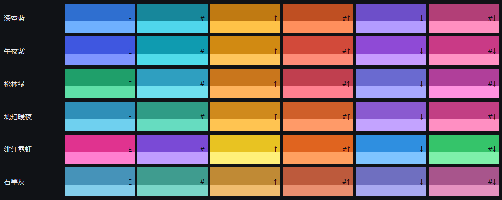

# 主题格式（配色主题 json）

程序的配色不是写死在代码里的，而是从 json 文件读的。**一个 json = 一套主题**，
里面写「角色 → 颜色」。主界面、右上角进度浮窗、跟奏面板、简谱编辑器都读同一套，
所以换主题是四处一起换。

> 代码那边对应的实现是 `theme.py`；这份文档是给想自己做主题的人看的。

## 一、文件放哪儿

程序启动时按顺序读这两个目录（**后面的同名主题覆盖前面的**）：

| 顺序 | 目录 | 说明 |
| --- | --- | --- |
| 1 | `<程序目录>\themes\*.json` | 便携版 / 绿色版：跟程序放一起，整个文件夹拷走就带走 |
| 2 | `%LOCALAPPDATA%\AutoPlay\themes\*.json` | 安装版默认在这儿；第一次运行会把六套预设写进去 |

文件名随便起（`我的主题.json` 也行），**主题叫什么由 json 里的 `name` 决定**。

改完不用重启：托盘图标右键 →「配色主题」→「重新载入主题文件」。
同一处还有「打开主题文件夹」，直接给你把目录打开。

## 二、文件长什么样

```json
{
  "name": "我的主题",
  "note": "写给自己看的一句话（会显示在托盘菜单的悬停提示里）",
  "preset_rev": 2,
  "colors": {
    "bg": "#101319",
    "panel": "#161a23"
  },
  "notes": {
    "":   ["#2f6fd0", "#6fb0ff"],
    "#":  ["#17879b", "#4fd6ec"]
  }
}
```

| 字段 | 必填 | 说明 |
| --- | --- | --- |
| `name` | 否 | 主题在菜单里显示的名字。不写就用文件名 |
| `note` | 否 | 一句话说明，显示在菜单项的悬停提示里 |
| `colors` | **是** | 角色 → 颜色。缺的角色自动用基准色补上，所以可以只写想改的那几个 |
| `notes` | 否 | 六种操作的音符色。不写就整套用基准色（见第五节） |
| `preset_rev` | 否 | **程序自己写的预设才有**。看到这个字段说明这文件是程序生成的：下次程序升级预设会把它整个重写掉。自己做的主题别带这个字段 |

颜色一律写 `#rrggbb`（六位十六进制，不分大小写）。写成别的（`red`、`#abc`、漏了 `#`）
不会让程序崩 —— 认不出来的色号会原样留着，大概率是那块看不见或者变透明。

json 写坏了（多了个逗号、少个引号）也只会**跳过这个文件**，程序照常用别的主题跑。

## 三、`colors` 里的角色表

一共 66 个角色，按用途分组。左边是角色名，右边是它管的地方。
| 角色 | 管哪儿 |
| --- | --- |
| `bg` | 窗口底色（最大的那块背景） |
| `panel` | 卡片 / 面板的底 |
| `panel_line` | 卡片描边 |
| `control` | 按钮、下拉框、圆钮的底 |
| `control_hover` | 控件鼠标悬停时的底 |
| `control_press` | 控件按下去那一刻的底 |
| `line` | 控件描边（输入框、按钮那圈线） |
| `log_bg` | 「控制台」那块运行日志的底 |
| `menu_bg` | 下拉列表 / 弹出菜单的底 |
| `row_hover` | 列表行悬停 |
| `row_off` | 列表里被禁用那行的字 |
| `text_row` | 列表行的正文 |
| `spin` | 数字框（QSpinBox）的底 |
| `spin_hover` | 数字框上下小箭头的悬停底 |
| `track` | 进度条 / 滑块的凹槽 |
| `track_off` | 禁用状态下的凹槽 |
| `base` | 更深一层的底（嵌在卡片里的那层） |

### 文字

| 角色 | 管哪儿 |
| --- | --- |
| `text` | 正文 |
| `text_strong` | 强调正文（标题下面那行、数值） |
| `text_dim` | 次要文字 |
| `text_faint` | 提示文字（小灰字） |
| `text_off` | 禁用状态的文字 |
| `text_icon` | 图标旁边那行字 / 日志正文 |
| `text_soft` | 比正文淡一点的字 |
| `text_tab_hover` | 标签页悬停时的字 |
| `white` | 纯白（用在彩色底上的强调字） |

### 主色（默认是蓝，跟着主题转）

| 角色 | 管哪儿 |
| --- | --- |
| `accent` | 主色：选中态、进度条、主按钮 |
| `accent_hover` | 主色悬停 |
| `accent_deep` | 主色按下 |
| `accent_soft` | 主色的浅版（描边、图形） |
| `accent_pale` | 主色的更浅版（浮窗上的字） |
| `accent_ice` | 主色的冰蓝版（状态文字） |
| `accent_bg` | 主色压暗当底用 |
| `accent_bg_hover` | 上面那个的悬停 |
| `accent_bg_current` | 下拉候选里「当前选中」那行的底 |
| `accent_text_current` | 上面那行的字 |
| `accent_text_off` | 下拉里被禁用那行的字 |
| `slider_handle` | 滑块把手 |
| `slider_handle_off` | 禁用状态的把手 |
| `scroll_handle_hover` | 滚动条把手的悬停色 |

### 关闭 / 危险 / 禁用

| 角色 | 管哪儿 |
| --- | --- |
| `close_hover` | 关闭按钮悬停（红） |
| `danger_bg` | 危险提示的底（红底） |
| `danger_line` | 危险提示的边框 |
| `danger_text` | 危险提示的字 |
| `danger_bg_hover` | 危险按钮悬停 |
| `off_bg` | 整块禁用的底 |
| `off_line` | 整块禁用的边框 |

### 状态胶囊（含义固定，不跟主题转）

| 角色 | 管哪儿 |
| --- | --- |
| `status_idle` | 状态胶囊：待机 |
| `status_play` | 状态胶囊：演奏中 |
| `status_pause` | 状态胶囊：暂停 |
| `status_error` | 状态胶囊：出错 |
| `status_rec` | 状态胶囊：录制中 |

### 简谱编辑器

| 角色 | 管哪儿 |
| --- | --- |
| `editor_bg` | 编辑器：整块的底 |
| `editor_lane` | 编辑器：卷帘行的底色（深的那条） |
| `editor_lane_light` | 编辑器：卷帘行的底色（浅的那条） |
| `editor_grid` | 编辑器：细网格线 |
| `editor_grid_bold` | 编辑器：粗网格线（一拍一根那种） |
| `editor_roll_line` | 编辑器：卷帘上横向的线 |
| `editor_key_dark` | 编辑器：左侧琴键的黑键 |
| `editor_key_light` | 编辑器：左侧琴键的白键 |
| `editor_key_edge` | 编辑器：琴键的描边 |
| `editor_ruler` | 编辑器：顶部时间刻度的底 |
| `editor_note_text` | 编辑器：画在音块上的字（要在亮色块上看得清） |
| `editor_cursor` | 编辑器：播放头那根竖线 |

### 跟奏面板

| 角色 | 管哪儿 |
| --- | --- |
| `follow_idle_glow` | 跟奏：没轮到、但马上要按的那一列的光 |
| `follow_dim` | 跟奏：已经过去 / 用不上的东西压暗后的色 |

**同一个色号被多个角色用时**，以 `theme.py` 里 `BASE` 的顺序为准（前面那个算）。
所以把 `bg` 和 `panel` 写成同一个颜色，程序会把界面上原本是 `bg` 的地方当 `bg` 处理 ——
一般不用管这件事，正常做主题时各角色给各自的颜色就行。

**状态胶囊那五个不跟主题转**：绿 = 正在演奏、黄 = 暂停、红 = 出错，
这几个颜色是「一眼就要认出来」的，所以就算你把主题做成一片灰，它们也不变。

## 四、预设有哪几套 / 参数是怎么算的

`theme.py` 里的 `PRESETS` 一共六套，它们的**界面颜色**是拿一份基准配色
（就是程序最早写死的那套深蓝）**整体转色相**算出来的：

| 主题 | 色相旋转 | 饱和度倍数 | 一句话 |
| --- | --- | --- | --- |
| 深空蓝 | 0° | 1.00 | 默认那套：深蓝底 + 蓝色主色 |
| 午夜紫 | +44° | 1.02 | 偏紫的夜色调 |
| 松林绿 | −74° | 0.96 | 墨绿底 + 青绿主色，看久了不累 |
| 琥珀暖夜 | −192° | 1.00 | 暖色调，晚上开着不刺眼 |
| 绯红霓虹 | +104° | 1.14 | 霓虹感最强，颜色浓 |
| 石墨灰 | −16° | 0.12 | 界面几乎无彩，音符还是彩色的 |

「整体转色相」的好处是**不会出现紫底配蓝按钮**这种脏搭配 —— 背景、控件、文字、
主色是一起转的，它们之间的明暗和对比关系永远保持住。

（`PRESETS` 里还有个可选的 `note_hue` / `note_sat`：预设没写死 `notes` 的时候，
拿它俩把音符那套整体转一下。六套预设都写了 `notes`，所以用不上。）

## 五、音符那六种操作色



这是整套配色里最要紧的一块。演奏时一个音要按哪个鼠标键，全看颜色：

| `notes` 的键 | 含义 | 鼠标 |
| --- | --- | --- |
| `""` | 什么都不按 | 只按 `1z 2x 3c…` |
| `"#"` | 升半音 | 中键 |
| `"A"` | 升调 | 右键 |
| `"#A"` | 升调 + 升半音 | 右键 + 中键 |
| `"B"` | 降调 | 左键 |
| `"#B"` | 降调 + 升半音 | 左键 + 中键 |

每个键对应**两个颜色**：`[尾色, 头色]`。长条从上往下走，色块是「尾色打底、
靠近头那截用头色」，所以同一个音在跟奏框里一眼能看出走向。

```json
"notes": {
  "":   ["#2f6fd0", "#6fb0ff"],
  "#":  ["#17879b", "#4fd6ec"],
  "A":  ["#c07a12", "#ffc247"],
  "#A": ["#bf4f22", "#ff8f5c"],
  "B":  ["#6d4fc9", "#b39bff"],
  "#B": ["#b23f77", "#ff8fc0"]
}
```

**六套预设的音符色是各自单独挑的**，不是拿基准转出来的 —— 整片转色相容易让
「橘 / 橘红」这一对转到绿色区就撞成一个颜色。挑的时候注意：

* 六种要**互相分得开**，尤其是 `""` vs `"#"`、`"A"` vs `"#A"`、`"B"` vs `"#B"` 这三对；
* **别低于 0.7 的饱和度**：等长演奏模式下色块短得写不下 `↑ # ↓` 那几个记号，
  颜色是唯一的线索，灰了就等于没标；
* 跟奏框最上面有一行「颜色 → 操作」的图例，配色改了它会跟着改，不用另外配。

## 六、自己加一套（三步）

1. 把 `%LOCALAPPDATA%\AutoPlay\themes\深空蓝.json` 拷一份，改名成 `我的主题.json`；
2. 打开，把 `name` 改成 `我的主题`，把 `preset_rev` 这一行**删掉**，
   然后照着第三、五节的表改颜色；
3. 托盘图标右键 →「配色主题」→「重新载入主题文件」。

想省事的话，`colors` 里只写你要改的那几个角色，别的会自动补上基准色：

```json
{
  "name": "护眼青",
  "note": "只把底色和主色换成了青",
  "colors": { "bg": "#0b1512", "panel": "#11201c", "accent": "#2fb98a" }
}
```

### 做好一套想共享？

把 json 发出去就行 —— 别人丢进上面任意一个 `themes\` 文件夹，重载一次就能用。
（发之前确认 `preset_rev` 已经删掉，不然程序升级时兴许会把它当预设覆盖掉。）
