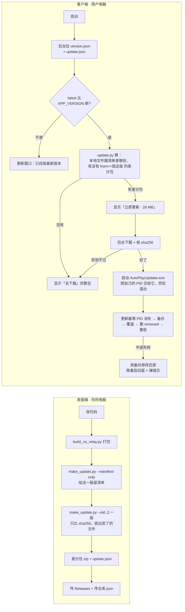

# 增量更新设计与实现（AutoPlay）

> **现状：已经做好并接进程序了**（v1.0.2 起）。
>
> * 发版端：`make_update.py`（算清单、比差异、做差分包、写 `update.json`）
> * 客户端：`update.py`（拉清单、规划、下载、校验）
> * 换文件的：`updater.py` → 打包成 `AutoPlayUpdater.exe`，跟着安装包装进安装目录
>
> v1.0.1 是**没有**更新器的：它能读到「有新版本」，但只能点「去下载」。
> 从 **v1.0.2** 开始才真正能「只下变了的文件」。
>
> 已经实走过两遍：
> * `更新包\` 里有 v1.0.2 的基准清单，和 v1.0.3 的差分包 + `update.json`；
> * 又有 v1.0.3 的基准清单，和 v1.0.4 的差分包 + `update.json`。
>
> 两次都是拿「上一版安装包」装出来的目录试「下差分包 → 更新器换文件 → 变成新版」，
> 完全版 / 精简版都通过，换完**目录里每个文件都跟完整安装包对上**（见 10.2）。
> v1.0.3 → v1.0.4 那一次只改了 `AutoPlay.exe` 和 `_internal/base_library.zip` 两个文件。

---

## 一、这个体量需要做增量更新吗？

先看数字（实测，完全版）：

| | 完整安装包 | 只换变了的文件（增量） |
| --- | --- | --- |
| 完全版 | 221 MB | 实测（1.0.3 → 1.0.4）**21.4 MB** |
| 精简版 | 103 MB | 实测（1.0.3 → 1.0.4）**6.5 MB** |

> 上面这两个数是「只改版本号 + 一句文案」这种最小改动时的大小 —— 也就是**常态**：
> 完全版那 21.4 MB 基本就是 `AutoPlay.exe` 本身（21 MB，所有 `.py` 都在里面）。
> 改的地方多一点就大一点，但那堆 100 MB 级的 DLL 不动。

程序目录里谁大：

```
AutoPlay\                                   约 400 MB / 2100+ 个文件
├── AutoPlay.exe               21.2 MB   ← 我们自己的 Python 代码全在这儿（PyInstaller 的 pyz）
├── _internal\                 约 380 MB
│   ├── llvmlite\binding\llvmlite.dll        114.8 MB  ← 一个文件就占四分之一
│   ├── onnxruntime\capi\...                  35.1 MB
│   ├── PySide6\Qt6*.dll                      25.7 MB
│   ├── numpy.libs\libscipy_openblas64...dll  19.4 MB
│   ├── scipy.libs\libscipy_openblas...dll    19.2 MB
│   ├── python312.dll                          6.6 MB
│   └── pretty_midi\TimGM6mb.sf2               5.7 MB
├── songs\                     内置曲库（更新时**一律不碰**，是用户自己的东西）
├── uninstall.exe
└── AutoPlayUpdater.exe        更新器（换文件的那个小 exe）
```

结论：

* 我们每改一次代码，只有 **`AutoPlay.exe`** 会变（所有 `.py` 都被打进了这一个文件）；
* 那些 100 MB 级的 DLL 只有在**换 Python 版本 / 升级依赖**时才动；
* 所以「每次 213 MB」里，真正需要的通常只有 20~35 MB。

**代价**：得有个 helper 进程在主程序退出后替它换文件，还要能校验、能回滚。
这部分已经在 `updater.py` 里做完了。

---

## 二、名词先记住

| 名词 | 一句话 |
| --- | --- |
| 版本号 | `1.0.2` 这种字符串，写在 `main.py` 的 `APP_VERSION` |
| 清单（manifest） | 某一版「有哪些文件、每个多大、指纹是多少」的一张表 |
| 指纹 sha256 | 对文件**内容**算出来的哈希。内容一样 → 指纹一样 → 就是「没变」 |
| 完整包 | 现在这个自解压安装程序 `.exe`，全量下载 |
| 差分包（patch） | 只装「这次变了的文件」的 zip |
| 更新器（helper） | 主程序退出后替它把文件换掉的那个小 exe：`AutoPlayUpdater.exe` |

---

## 三、核心问题：怎么确认哪些文件是「增量文件」？

### 3.1 一句话

> **只比 `sha256`。** 新版本清单里的某个文件，如果它的 `sha256` 跟上一版清单里的
> 不一样（或者上一版根本没有这个文件），它就是**增量文件**；一样就是没变，不进包。

**不看**修改时间，**不看**文件大小，**不看**文件名 —— 只看内容指纹。

| 如果看… | 会怎么错 |
| --- | --- |
| 修改时间 | 重新打包会让**所有**文件的时间戳都变 → 每个文件都被当成「变了」→ 差分包跟完整包一样大 |
| 文件大小 | 「改了一个字符」→ 大小可能一模一样 → 真变了的文件被漏掉 → 用户更新完程序是坏的 |
| 文件名 | 改个名就当成「删一个 + 加一个」，其实内容没变，白下 100 MB |

`sha256` 唯一的问题是**读文件要花点时间**（要读一遍全部内容），但它是唯一靠谱的判据。

### 3.2 具体算法（发版端）

```text
输入：
    new_manifest = 新版本每个文件的 sha256   （从 build_installer\payload-<edition>.zip 里算）
    old_manifest = 上一版每个文件的 sha256   （上次发版时存下来的 更新包\manifests\<版本>-<edition>.json）

changed = []
removed = []

for 路径 rel in new_manifest:
    if old_manifest 里没有 rel:                 # 新加的文件
        changed.append(rel)
    elif old_manifest[rel].sha256 != new_manifest[rel].sha256:   # 内容变了
        changed.append(rel)

for 路径 rel in old_manifest:
    if new_manifest 里没有 rel:                 # 新版本删掉的文件
        removed.append(rel)

差分包 = zip( changed 这些文件的内容 + _patch/manifest.json )
_patch/manifest.json = {
    format: "autoplay-patch",
    from: 旧版本, to: 新版本,
    files:   { rel: {size, sha256} },   # 每个都应该是这个 sha256
    removed: [ rel, ... ],              # 更新时要把这些删掉
}
```

代码就这几行（`make_update.py`）：

```python
def diff(old_files, new_files):
    changed = [rel for rel, info in sorted(new_files.items())
               if not old_files or (old_files.get(rel) or {}).get('sha256') != info.get('sha256')]
    removed = [rel for rel in sorted(old_files or {}) if rel not in new_files]
    return changed, removed
```

### 3.3 一张图

```
   上一版 (1.0.2) 的清单                 这一版 (1.0.3) 的清单
   ┌───────────────────────────┐        ┌───────────────────────────┐
   │ AutoPlay.exe        a1b2… │        │ AutoPlay.exe        f9e8… │──┐
   │ _internal\Qt6Core   c3d4… │        │ _internal\Qt6Core   c3d4… │  │ 指纹一样
   │ _internal\llvmlite  1234… │        │ _internal\llvmlite  1234… │  │ → 不进包
   │ _internal\old.dll   5678… │        │ (没有了)                   │  │
   │                           │        │ _internal\new.dll   0abc… │  │
   └───────────────────────────┘        └───────────────────────────┘  │
                                                                       ▼
   差分包里装的东西：                 ┌──────────────────────────────────────┐
   ┌──────────────────────────┐      │ AutoPlay.exe              （内容变了） │
   │ AutoPlay.exe      f9e8…  │◀─────┤ _internal\new.dll         （新增）    │
   │ _internal\new.dll 0abc…  │      └──────────────────────────────────────┘
   │ _patch\manifest.json     │      removed: ["_internal/old.dll"]（更新时删掉）
   └──────────────────────────┘
```

### 3.4 哪些文件会被扫到？

只扫 **payload 里的 `app/` 那棵树** —— 也就是「装到安装目录里的程序本体」。

* `songs/`（内置曲库）**不扫、不更新**：用户自己也往里放曲子，覆盖会把人家的东西弄丢；
  想要新曲子走「联网曲库」。
* `%LOCALAPPDATA%\AutoPlay\`（设置 / 日志 / 谱面 / 录制的曲子）本来就不在安装目录里，天然不碰。

### 3.5 差分包为什么能这么小？两个「假变化」要按下去

因为 `AutoPlay.exe`（21 MB）每次必变，其它 DLL 基本不变。
**唯一例外**：升级依赖（换 Python 版本、升 numpy / PySide6）时，那一堆 100 MB 级的 DLL
会跟着变 —— 那种版本差分包会很大，**直接推完整包更划算**（发版时看一下差分包大小，
比完整包还大就别做增量了，命令行里有打印）。

另外还有两个「源码没改、字节也会变」的假变化，不处理的话每次发版白送 16 MB：

| 假变化 | 为什么变了 | 怎么办的（`make_installer.py` 里） |
| --- | --- | --- |
| `uninstall.exe`、`AutoPlayUpdater.exe` | PyInstaller 每次打包都会写进打包时间之类，**源码一个字没改，sha256 也不一样** | 记一份「这个小 exe 是拿哪些源码打出来的」；源码和图标都没变就**沿用上次那份**，不重打 |
| `_internal\base_library.zip` | 同上（主程序用的标准库压缩包，每次重打都会变） | 没办法，认了 —— 它只有 1.3 MB |

实测效果（1.0.2 → 1.0.3 这种最小改动）：**完全版 36.6 MB → 21.4 MB，
精简版 21.6 MB → 6.5 MB**。

---

## 四、仓库里放什么

### 4.1 两个曲库仓库根目录（Gitee 的 `juanneys/midi-music` + GitHub 的备用源）

```
library.json     曲库索引（已有的）
version.json     版本信息（客户端启动就读）
notice.json      公告（客户端启动就读）
update.json      增量更新清单（客户端点「更新」时读）← 就是这份文档说的东西
themes.json      线上配色（预埋，客户端暂时只显示一条灰色的「线上主题（未上线）」）
```

跟 `library.json` 一样走 **contents API**（拿 base64 再解）—— Gitee 的 raw 会对中文文本
过内容审核（回 451）。GitHub 那边先走 raw，不行再走 API；两套曲库互相兜底。

### 4.2 `version.json`

```json
{
  "format": "autoplay-version",
  "version": 1,
  "latest": "1.0.3",
  "min_supported": "1.0.2",
  "published": "2026-10-03",
  "notes": "修了几个小问题",
  "links": {
    "bilibili": "https://space.bilibili.com/341688158",
    "github": "https://github.com/xXjuanneysXx/Auto-Midi-Player",
    "download_page": "https://space.bilibili.com/341688158",
    "library": "https://gitee.com/juanneys/midi-music"
  },
  "update_manifest": "update.json"
}
```

| 字段 | 干嘛的 |
| --- | --- |
| `latest` | 最新版本号。跟 `APP_VERSION` 比，一样就说「已经是最新版本」 |
| `notes` | 一句话更新说明，显示在「更新」窗口里 |
| `links.*` | 顶部几个按钮的跳转地址，改了不用重新发版。`download_page` 就是「去下载」按钮跳的那儿 —— 现在指 B站主页（下载链接发在那儿）；想换回 GitHub 发行版页改这一个字段就行（程序里 `notice.DEFAULT_LINKS` 只是拉不到 json 时的兜底，也一起改成了 B站） |
| `update_manifest` | 增量清单的文件名（就是 `update.json`），填了就能随时改名 |
| `min_supported` | 比它还老的版本「必须走完整包」（预埋，客户端还没用它做强制更新） |

> **`latest` 和 `update.json` 的 `latest` 要一致**。如果只更新了 `update.json`，
> 程序也会认（以 `update.json` 说的为准），但两个都改最不容易乱。

### 4.3 `update.json`（发版脚本自动生成，别手写）

```json
{
  "format": "autoplay-update",
  "generated": "2026-10-03 21:00:00",
  "latest": "1.0.3",
  "min_supported": "1.0.2",
  "notes": "修了几个小问题",
  "editions": {
    "full": {
      "label": "完全版",
      "version": "1.0.3",
      "package": { "url": ".../AutoPlay 完全版 安装程序 v1.0.3.exe", "size": 223000000, "sha256": "..." },
      "files": [ { "path": "AutoPlay.exe", "size": 22200000, "sha256": "..." }, ... ],
      "patches": [
        { "from": "1.0.2", "to": "1.0.3",
          "url": ".../AutoPlay-patch-full-1.0.2-to-1.0.3.zip",
          "size": 26000000, "sha256": "...",
          "removed": [ "_internal/旧文件.dll" ] }
      ]
    },
    "lite": { "...": "结构一样" }
  }
}
```

* `editions`：完全版 / 精简版分开（客户端按 `edition.LITE` 选自己那份）。
* `files`：这一版**全部**程序文件（不只是变了的）—— 客户端拿它跟自己目录对，
  决定「我到底缺什么」。
* `patches`：一条 = 「从 `from` 这一版能直接升到 `to` 这一版」。v1.0.6 起可以挂好几条：
  累积包（`1.0.3→1.0.6`、`1.0.4→1.0.6`）+ 直跳包（`1.0.5→1.0.6`）+ 上一版接着用的老包
  （`1.0.4→1.0.5`）。客户端先找 `from == 自己版本` 的直达包；找不到就用 `patch_chain()`
  在 `from → to` 之间找一条最短链串着升（见 7.5）；**真接不上**才退回完整包。

### 4.4 差分包和完整包放哪儿

| 文件 | 放哪 | 为什么 |
| --- | --- | --- |
| 差分包 `AutoPlay-patch-*.zip` | **Gitee Releases 附件**（GitHub Releases 也各放一份） | 国内直连快；Gitee 单文件上限 100 MB，差分包几十 MB 够用；**两份互为兜底**（`update.json` 里 `url` 指向哪个就用哪个） |
| 完整安装包 `AutoPlay * 安装程序 v*.exe` | **GitHub Releases** | 213 MB，Gitee 传不上去（>100 MB） |
| `update.json` / `version.json` / `notice.json` / `themes.json` / `manifests\` | 两个曲库仓库根目录 | 小文件，走 contents API |

---

## 五、整体流程

### 5.1 两条线（mermaid）



### 5.2 客户端一次更新的时间线（ASCII）

```
主程序 AutoPlay.exe                     AutoPlayUpdater.exe（从 %TEMP% 里跑）
      │                                            │
      │ 1. 拉 update.json（点「更新」时）             │
      │ 2. 逐文件算 sha256，算出「本地跟清单差哪些」    │
      │ 3. 找到 from==1.0.2 的差分包，显示「立即更新」 │
      │ 4. 下载 → %LOCALAPPDATA%\AutoPlay\update\    │
      │ 5. 核「整包大小 + sha256」                    │
      │ 6. 把 AutoPlayUpdater.exe 复制到 %TEMP%      │
      │    启动它，把自己的 PID 交给它                 │
      │──────────────────────────────────────────▶   │
      │ 7. 主程序退出（进程消失）                      │ 8. WaitForSingleObject 等 PID 消失
      ✗                                            │ 9. 备份要被换掉的文件 → 临时目录
                                                   │10. 逐文件覆盖，写一个核一个 sha256
                                                   │11. 删掉 removed 列表里的文件
                                                   │12. 成了 → 删备份 → 启动 AutoPlay.exe
                                                   │    败了 → 用备份还原 → 也启动 AutoPlay.exe
                                                   │13. 退出自己
                                                   │
      │ 14. 起来了（新版本，或还原后的旧版本）          │
```

### 5.3 更新窗口长什么样

```
┌─ 更新 ─────────────────────────────────────────────┐
│ 当前版本：v1.0.2                                    │
│ 最新版本：v1.0.3        （有新版本！）                │
│ 发布时间：2026-10-03                                │
│                                                     │
│ 修了几个小问题                                        │
│                                                     │
│ 可以增量更新：只下 v1.0.3 新改的那些文件（26.0 MB），  │
│ 不用重下整个安装包。                                  │
│                                                     │
│ 点「立即更新」：下好之后程序会自己退出、换好文件，     │
│ 再自己开回来。                                        │
│                       [重新检查] [立即更新] [关闭]    │
└─────────────────────────────────────────────────────┘
```

下载的过程中，正文会变成 `正在下载更新包… 12.3 / 26.0 MB（47%）`。

---

## 六、发版：三步（照抄命令）

项目目录（`K:\midi`）下：

### 第 1 步 · 打包

```powershell
python -u -X utf8 build_no_relay.py
```

产物在 `发布\`：`AutoPlay 完全版/精简版 安装程序 v<版本>.exe`，
中间文件 `build_installer\payload-full.zip` / `payload-lite.zip` 是下一步要读的。

### 第 2 步 · 生成清单 + 差分包 + update.json

**给这一版留一份清单**（只有「这一版没打算做差分包」时才需要单独跑这条 —— 比如最开头
那版，或者你自己手动发的版本；跑下面那条带 `--old` 的会顺手把新版本的清单也存下来）：

```powershell
python -X utf8 make_update.py --version 1.0.3 --manifest-only
```

> 清单是**下一版做差分包时的基准**（`更新包\manifests\<版本>-<edition>.json`），
> 一旦发出去就别删；删了下一版就找不到「上一版」，只能整包推。

**要给旧版本做差分包时**（`--old` 后面跟旧版本号，可以给好几个）：

```powershell
python -X utf8 make_update.py --version 1.0.4 --old 1.0.3 `
  --patch-base   "https://gitee.com/juanneys/midi-music/releases/download/v1.0.4" `
  --package-base "https://github.com/xXjuanneysXx/Auto-Midi-Player/releases/download/v1.0.4" `
  --min-supported 1.0.3 `
  --notes "修了几个小问题"
```

> 发 v1.0.6 时同时给 1.0.3 / 1.0.4 / 1.0.5 做了包，用的就是：
> `--old 1.0.5 1.0.4 1.0.3`。每个旧版本各做一份「直达到新版」的**累积差分包**
> （完全版 + 精简版都有），上一版清单里挂着的老包会自动接着带过来，不用重做。
>
> `--min-supported 1.0.3` 的意思是「比 1.0.3 还老的版本别走增量，直接下完整包」——
> 跟 `patches[].from` 是配套的（有 1.0.1 的差分包就写 1.0.1）。不写就默认等于新版本号，
> 那样等于「谁都别用增量」（客户端暂时还没拿它拦人，但值写对了以后能直接用）。

产物：

```
更新包\
├── manifests\
│   ├── 1.0.2-full.json          ← 基准清单（留着，别删）
│   ├── 1.0.2-lite.json
│   ├── 1.0.3-full.json
│   ├── 1.0.3-lite.json
│   ├── 1.0.4-full.json
│   └── 1.0.4-lite.json
├── 1.0.4\
│   ├── AutoPlay-patch-full-1.0.3-to-1.0.4.zip   ← 差分包（传 Gitee Releases）
│   ├── AutoPlay-patch-lite-1.0.3-to-1.0.4.zip
│   └── update.json                              ← 传两个曲库仓库根目录
```

`--old` 给了 N 个旧版本，产物就是 `N × 2` 个差分包（每个旧版本 × 完全版/精简版）：

```
更新包\1.0.6\
├── AutoPlay-patch-full-1.0.5-to-1.0.6.zip   ┐
├── AutoPlay-patch-full-1.0.4-to-1.0.6.zip   │ 传 Gitee Releases（tag v1.0.6）
├── AutoPlay-patch-full-1.0.3-to-1.0.6.zip   │
├── AutoPlay-patch-lite-1.0.5-to-1.0.6.zip   │
├── AutoPlay-patch-lite-1.0.4-to-1.0.6.zip   │
├── AutoPlay-patch-lite-1.0.3-to-1.0.6.zip   ┘
└── update.json                              ← 传两个曲库仓库根目录
```

> `--patch-base` / `--package-base` 是「文件传上去之后能下载到的地址前缀」——
> 脚本拿它拼 `update.json` 里的 `url`。**先按 Release 的 tag 地址填好**，再传文件。
> 命令最后会把「接下来该传什么、传到哪」再打一遍。

### 第 3 步 · 传上去

见第十节那张表。

---

## 七、客户端：一次更新的 6 步（对应代码）

代码在 `update.py`（算 + 下 + 校验）和 `main.py` 的 `open_update` / `start_incremental_update`。

**第 1 步 · 拉清单**

```python
def manifest(timeout=notice.DEFAULT_TIMEOUT):
    return notice.update_info(timeout=timeout)      # 拉 update.json，故意不缓存
```

> 为什么 **不缓存**：它是一条「更新指令」。用旧的缓存会算错「该下哪个包」，
> 甚至去下一个已经下架的差分包。公告 / 版本信息可以缓存兜底，这个不行。

**第 2 步 · 规划（`update.plan`）**

```python
def plan(current, install_dir, data=None):
    # 1) 这一版（full/lite）的 files 列出来
    # 2) 逐文件跟本地比 sha256 → 本地哪些文件跟清单不一样 / 缺了
    # 3) 本地文件已经全对 → mode='none'（不用更新）
    # 4) 找 patches 里 from == current 的那条 → mode='patch'
    # 5) 没有差分包 → mode='full'（去下载完整包）
```

三种结果对应界面上三种按钮：`none` → 只有「关闭」；`patch` → 「立即更新」；
`full` / `error` → 「去下载」。

**第 3 步 · 下载（后台线程，界面不卡）**

* 存到 `%LOCALAPPDATA%\AutoPlay\update\`；
* 两道闸：**每读一块最多等 30 秒**（卡住的连接在这儿断）+ **整包最多下 15 分钟**；
* 下完核「大小」和「sha256」，**任一个不对就整个放弃**（不装半成品）。

**第 4 步 · 交给更新器**

```python
# update.py
runner = %TEMP%\AutoPlayUpdate\AutoPlayUpdater.exe   # 先把自己复制到临时目录
subprocess.Popen([runner, '--patch', zip, '--target', 安装目录, '--version', 新版本,
                  '--exe', 'AutoPlay.exe', '--pid', os.getpid(), '--timeout', '300',
                  '--relaunch'])
```

> **为什么要复制到 `%TEMP%`**：更新器待会儿要覆盖安装目录里的**自己**。
> 正跑着的 exe 锁着自己，不先搬走就换不了。

然后主程序 `quit_app()` —— 真的退出，把文件锁让出来。

**第 5 步 · 更新器换文件（`updater.py`）**

1. `WaitForSingleObject` 等主程序 PID 消失（最多 300 秒，等不到就 `taskkill` 兜底）；
2. 读差分包里的 `_patch\manifest.json`；
3. 把「要覆盖 / 要删」的文件**先备份**到临时目录；
4. **先把整个包逐文件核一遍 sha256，全对才动盘**；
5. 逐个覆盖，写进去以后再核一遍（防磁盘满 / 杀软拦截）；
6. 删掉 `removed` 列表里的文件；
7. 成了 → 删备份 → 启动 `AutoPlay.exe`；败了 → **用备份原样还原** → 也启动 `AutoPlay.exe` + 弹一句提示。

**第 6 步 · 起来之后**

没有 `.bak`、没有 `state.json` 之类需要清理的残留：更新器跑完就把备份删了。
日志在 `%TEMP%\AutoPlayUpdate\updater.log` 和 `%LOCALAPPDATA%\AutoPlay\AutoPlay.log`
（搜索「更新器」）—— 出问题先看这两个。

---

## 七·五、多跳增量 & 累积差分包（v1.0.6 起）

### 7.5.1 以前的问题

清单里只有「一跳一跳」的包（1.0.3→1.0.4、1.0.4→1.0.5…）、手上这版又没有直达最新版
的包时，旧客户端只会去下 221 MB 的完整安装包 —— 因为它只认 `from == 我现在这版`
的那一跳（`update.py` 老的 `patch_for()`）。

### 7.5.2 现在两条一起上

**① 发版端做「累积差分包」**：发一次版，给每个还活着的旧版本各做一份「直达到新版」
的包（`--old` 给好几个）：

    1.0.3 ────────────────────────────► 1.0.6   AutoPlay-patch-full-1.0.3-to-1.0.6.zip
    1.0.4 ────────────────────────────► 1.0.6   AutoPlay-patch-full-1.0.4-to-1.0.6.zip
    1.0.5 ────────────────────────────► 1.0.6   AutoPlay-patch-full-1.0.5-to-1.0.6.zip

    （每个包的「改了哪些文件」= 拿那一版的基准清单跟新版清单比 sha256；
      越老的版本，包里要带的变化越多，包也越大）

**② 客户端会把老包串成链**：万一某个旧版本的直达包没做 / 没传，`update.py` 的
`patch_chain()` 会在清单里按 `from → to` 找一条 `我现在这版 → 最新版`
的**最短路径**（BFS），把整条链上的包按顺序下下来，交给更新器**一次盖完**：

    1.0.3 ──► 1.0.4 ──► 1.0.5 ──► 1.0.6
           包A         包B         包C
    （三个包一起下，更新器按 A → B → C 顺序覆盖；任何一个核对不上 / 写不进，
      整条链一起回滚，回到更新前的样子）

清单里两种会同时挂着，客户端**优先走跳数最少的**（一般就是一跳到位）：

    update.json → editions.full.patches = [
        1.0.3 → 1.0.6      ← 这次新做的累积包
        1.0.4 → 1.0.6      ← 这次新做的累积包
        1.0.5 → 1.0.6      ← 这次新做的直跳包
        1.0.4 → 1.0.5      ← 上一版清单里挂着的，原样接着用（多跳兜底）
    ]

> 上一版清单里的老包**不会重做**：`make_update.py` 会自动去
> `更新包\<上一版>\update.json` 里把它们原样抄过来（`carry_patches()`）——
> 那些包已经在 Releases 上躺着了，重做既浪费又会让老用户白下。

> **包数怎么控制**：现在「每个旧版本一份累积包」其实是重复劳动 —— v1.0.7 的
> `1.0.3→1.0.7`、`1.0.4→1.0.7`、`1.0.5→1.0.7` 三份包解开后文件集与 sha256
> **逐个相同**，只是 `_patch\manifest.json` 里的 `from` 不一样。把「改动集合
> 相同」的版本合成一组、只传一份包（`update.json` 里组内每个 `from` 各写一条、
> 共用同一个 URL），每次发版就固定是 4 个包，客户端照样一跳到位。
> 取舍、数字和落地步骤见 **`docs/发版策略.md`**。

### 7.5.3 发版端「路径大小写」的坑（v1.0.6 实测踩到）

PyInstaller 打包时同一个 DLL 有时候写成 `VCRUNTIME140.dll`、有时候写成
`vcruntime140.dll`。老的 `diff()` 按字符串比路径，会把这种**只有大小写不同**的同一个
文件当成「删一个、加一个」：更新器先把它写进去，回头又按 `removed` 列表删掉 ——
装完程序少了两个 VC 运行库（精简版实测）。

现在 `diff()` **按不区分大小写比路径**（Windows 的安装目录本来就不区分），
相同就打平；`changed` 用新版清单里的写法。发版后用「拿老安装包解出来的 payload 套
差分包，再跟新版清单逐文件核 sha256」这套办法验过：完全版 / 精简版 ×
（1.0.3、1.0.4、1.0.5 → 1.0.6）六个组合全对。

---

## 八、回滚与兜底

| 场景 | 会怎么样 |
| --- | --- |
| 差分包下载失败 / 超时 | 更新窗口显示原因 + 「去下载」完整包 |
| 差分包 sha256 对不上 | 直接删掉重下；界面提示「文件坏了或者被人换过」 |
| 差分包里某个文件内容不对 | 更新器**在动盘之前**就发现 → 什么都不改，提示失败 |
| 覆盖到一半失败 | 用备份**原样还原**，再把旧版启动起来 |
| 用户手上这版没有直达最新版的包 | `patch_chain()` 先在清单里找一条链，串起来一跳一跳过去；**真接不上**（比如 1.0.0 那种从没做过包的版本）才给 `full` → 走完整包 |
| 老版本（v1.0.1）没有更新器 | `launch_updater` 发现安装目录里没有 `AutoPlayUpdater.exe` → 提示下载完整包 |
| 用户点了「立即更新」又去关编辑器没保存 | 主程序先不退出（`quit_app` 返回 False），窗口会说明「更新器在后台等着，存好关掉就会自动换」 |

---

## 九、坑（重点，别踩）

| 坑 | 怎么回事 | 我们怎么办的 |
| --- | --- | --- |
| 自己覆盖自己 | 运行中的 `AutoPlay.exe` / 已加载的 DLL 被 Windows 锁住 | 单独一个 `AutoPlayUpdater.exe`，**复制到 `%TEMP%` 再跑**，等主进程退出 |
| 拿修改时间当「变了没」 | 重新打包会让所有文件时间戳都变 → 差分包白做 | 只看 `sha256` |
| 拿文件大小当「变了没」 | 改一个字符大小可能不变 → 漏更新 → 用户程序坏 | 只看 `sha256` |
| 权限 | 装在 `C:\Program Files` 要管理员才能写 | 默认装 `%LOCALAPPDATA%\AutoPlay`（不用 UAC）；装在 Program Files 时更新器得请求提权（**还没做**，那条路现在会失败并提示下完整包） |
| 杀软误报 | 「一个程序偷偷换掉另一个程序」很像病毒 | 可回滚；不静默替换（界面明说会退出重启）；以后有精力可做代码签名 |
| 半路断电 | 覆盖到一半断电 → 程序起不来 | 更新器每次启动都从零开始：先备份，失败（含下次重跑）就用备份还原 |
| PyInstaller 的 pyz | 所有 `.py` 打成一块塞进 `AutoPlay.exe`，改一行也要换整个 21 MB | 正常；增量的收益来自「不下载那 380 MB 的 DLL」 |
| 依赖升级 | 换 Python / 升 numpy 时几百 MB 的 DLL 也会变 | 那种版本别做增量，直接推完整包 |
| PyInstaller 重打不重现 | 源码没改，`uninstall.exe` / `AutoPlayUpdater.exe` 的字节也会变 | 源码没变就沿用上次那份（见 3.5）；`base_library.zip` 认了 |
| `songs/` 被覆盖 | 用户自己往里放了曲子 | 清单只扫 `app/`，`songs/` 一律不碰 |
| Gitee 单文件 100 MB | 完整包传不上去 | 完整包走 GitHub Releases，差分包走 Gitee Releases |
| **jsDelivr 镜像的长缓存** | 客户端读 `version.json` / `update.json` 时如果退回 GitHub 那条路，会经 `library.mirrors()` 自动补的 jsDelivr（`cdn.jsdelivr.net/gh/用户/仓库@分支/...`）。它对**分支地址**缓存 **12 小时**（`s-maxage=43200`），而且**查询串不进缓存键** —— 实测裸地址、`?_=…`、`?v=…` 三个地址回的是同一份副本（`X-Cache: HIT, HIT`、`Age` 一样），所以「URL 加时间戳」这招没用。症状：明明发了新版，老客户端一直说「已经是最新」。 | 索引类 json（`version.json` / `notice.json` / `update.json` / `library.json`）**一律不走镜像**：`library.mirrors()` 拆出了 `mirror_urls()`，`_try_all(..., mirror=False)` 只试原地址；`notice.py` 的 GitHub 分支改成 raw → contents API（带令牌，实时）→ **最后**才用镜像兜底。只有 midi 那种不怎么变的二进制文件继续用镜像。（2026-10-04 v1.0.5 实测记录见 `CHANGELOG.md`） |
| **同一个文件只有路径大小写变了** | PyInstaller 有时把 VC 运行库写成 `VCRUNTIME140.dll`、有时写成 `vcruntime140.dll`。按字符串比路径 = 「删一个、加一个」，更新器会**先写进去再按删除列表删掉**（v1.0.6 精简版实测：装完少两个 DLL）。 | `diff()` 改成**按不区分大小写比路径**（Windows 安装目录本来就不区分）；`changed` 用新版清单里的写法。发版后拿老安装包套差分包、逐文件核 sha256 验过六个组合（见 7.5.3）。 |

---

## 十、上传清单 & 怎么测

### 10.1 传什么、传到哪

| 传什么 | 传到哪 |
| --- | --- |
| `更新包\<版本>\AutoPlay-patch-*.zip` | **Gitee Releases** 附件（tag `v<版本>`）+ GitHub Releases 各一份。v1.0.6 起是「每个 `--old` 一个包 × 完全版/精简版」：`--old 1.0.5 1.0.4 1.0.3` 就是 6 个（1.0.3/1.0.4/1.0.5 → 1.0.6 各一份 full + lite） |
| `发布\AutoPlay * 安装程序 v<版本>.exe` | **GitHub Releases**（tag `v<版本>`） |
| `更新包\<版本>\update.json` | 两个曲库仓库根目录 |
| `version.json`（改 `latest` / `notes` / `published`） | 两个曲库仓库根目录 |
| `notice.json`（想发公告就加一条） | 两个曲库仓库根目录 |
| `themes.json`（预埋，暂时可以不动） | 两个曲库仓库根目录 |
| `更新包\manifests\*.json` | 曲库仓库根目录下的 `manifests\`（**只是留档**，客户端不读；下次发版你自己要有一份） |

> `update.json` 里的 `url` 必须跟实际传上去的**文件名、tag** 对得上，
> 所以第六节先跑脚本（把地址前缀填好）再传。

### 10.2 怎么测「增量」这条路（需要两个版本）

1. 装 **v1.0.3**（v1.0.2 起就带 `AutoPlayUpdater.exe` 了）；
2. 把代码里 `APP_VERSION` 改成 `1.0.4`，随便改一句看得见的文案 → 打包 → 生成差分包；
3. 把差分包、`update.json`、`version.json` 传上去；
4. 打开装的 v1.0.3 → 点「更新」→ 应该看到「可以增量更新……（xx MB）」；
5. 点「立即更新」→ 下载 → 程序自己退出 → 一会儿自己开回来 → 右下角变成 v1.0.4。

**测多跳**（v1.0.6 起）：

1. 发新版时**只做相邻的一跳**（比如 `--old 1.0.6`，生成 `1.0.6→1.0.7`），清单里别放
   `1.0.5→1.0.7` 这种累积包；
2. 装 v1.0.5 → 点「更新」→ 更新窗口应该写「可以分 2 步增量更新（v1.0.5 → v1.0.6 → v1.0.7）」；
3. 点「立即更新」→ 下载进度会写「正在下载第 1/2 个更新包…」→ 一次重启后就是 v1.0.7；
4. 想测失败回滚：把第二个包的 sha256 在 `update.json` 里改坏一个字符 → 应该看到
   「已经还原回原来的版本」，装着的还是 v1.0.5。

> `v1.0.1` 只能用来测「提示有新版本、点去下载」（它没有更新器）。

---

## 十一、一句话总结

发版时多跑一条 `make_update.py`：
**按 `sha256` 挑出「跟上一次不一样」的文件（只看指纹，不看时间/大小）→ 打成差分包 →
写 `update.json` → 传 Releases + 仓库**；
用户点「立即更新」后：**下几十 MB → 核指纹 → 主程序退出 → `AutoPlayUpdater.exe` 备份并替换 →
失败就还原 → 重启**。手上这版没有直达最新版的包时，先顺着一跳一跳的老包串成链过去
（多跳，一次装完）；真接不上才退回完整安装包。
